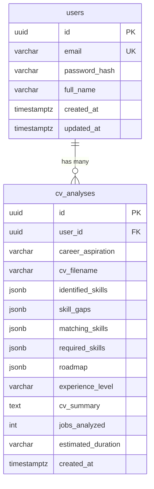

## Enhancement Summary

**Deepened on:** 2026-05-15
**Sections enhanced:** 12
**Research agents used:** architecture-strategist, security-sentinel, performance-oracle, kieran-python-reviewer, kieran-typescript-reviewer, data-integrity-guardian, pattern-recognition-specialist, code-simplicity-reviewer, data-migration-expert, spec-flow-analyzer, best-practices-researcher, repo-research-analyst, framework-docs-researcher, frontend-design-skill, document-review-skill, Context7 (FastAPI, pdfplumber, Gin)

### Key Improvements
1. **P0 Fix: Go server `WriteTimeout` of 15s will kill every analysis request** — must increase for the analysis route
2. **P0 Fix: Nullable SQL columns vs non-nullable Go types** — `pgx.Scan` will crash at runtime
3. **P0 Fix: Missing service layer** — plan violates the codebase's `handler → service → repository` convention
4. **P0 Fix: Response envelope undefined** — must explicitly use `{"data": ...}` wrapping
5. **P1: Parallelize PDF parsing + job scraping** — `asyncio.gather()` saves 5-15s per request
6. **P1: Reduce LLM calls from 3 to 2** — combine gap analysis + roadmap into single call
7. **P1: Cache scraped jobs in Redis** — 6h TTL eliminates repeat scraping latency
8. **P1: Add concurrency semaphore** — max 3 concurrent analyses to prevent memory exhaustion
9. **P1: Type-safe career roles** — use `StrEnum` in Python and `as const` in TypeScript
10. **P1: Concrete `apiFetch` fix** — detect `FormData` and omit `Content-Type` header

### New Considerations Discovered
- Server `WriteTimeout: 15s` in `cmd/server/main.go` will terminate every analysis (needs 120s+)
- Existing AI proxy uses `strings.NewReader(string(body))` which corrupts binary PDF data
- `cv_summary` and `cv_filename` store PII — prompt LLM for skills-only summary, sanitize filenames
- Scanned/image-based PDFs (common in Indonesia) return empty text — must detect and reject with helpful error
- `matching_skills` is derivable from `identified_skills ∩ required_skills` — consider removing from schema
- No test plan specified — critical gap for a feature involving LLM output parsing
- Prompt engineering is the hardest part and is completely deferred — should be done before coding
- Glints may use client-side rendering — spike needed before committing to scraping approach

---

# feat: CV Upload & Career Analysis Core Feature

## Overview

Implement the core product flow: user uploads a PDF CV and selects a target career from a preset dropdown. The AI service parses the CV, scrapes live job listings from Glints, analyzes skills against job requirements using Gemini 2.0 Flash, and returns a skill gap analysis + personalized learning roadmap. Results are persisted so users can revisit without re-analyzing.

This is the gateway feature — all other features (job matching, micro-challenges, progress tracking) depend on this analysis being completed first.

## Problem Statement / Motivation

Indonesian job seekers face a "skill gap paradox" — they don't know which skills they're missing for their target career, and existing job portals don't provide actionable skill gap analysis. SiapKerja solves this by analyzing a user's CV against real job market requirements and providing a concrete learning roadmap to close the gaps.

## Proposed Solution

A single combined endpoint that accepts a PDF file + career aspiration, performs the full analysis pipeline (parse → scrape → analyze → roadmap), and returns structured results. The Go API handles file upload + persistence, the Python AI service handles all intelligence.

### Architecture Flow

```
Browser                    Go API (:8080)              Python AI (:8000)
  │                            │                            │
  │ POST /api/ai/analyze-cv    │                            │
  │ (multipart: pdf + role)    │                            │
  │──────────────────────────► │                            │
  │                            │ Validate PDF (type, size,  │
  │                            │   magic bytes)             │
  │                            │ POST /analyze-cv           │
  │                            │ (multipart: pdf + role)    │
  │                            │──────────────────────────► │
  │                            │                            │ Phase 1 (parallel):
  │                            │                            │   1. Extract PDF text
  │                            │                            │   2. Scrape Glints jobs
  │                            │                            │ Phase 2 (sequential):
  │                            │                            │   3. LLM: extract skills
  │                            │                            │   4. LLM: gap analysis
  │                            │                            │      + generate roadmap
  │                            │      JSON response         │
  │                            │ ◄──────────────────────────│
  │                            │                            │
  │                            │ Save to cv_analyses table  │
  │  {"data": AnalysisResult}  │                            │
  │ ◄──────────────────────────│                            │
```

### Research Insights

**Architecture Improvements:**
- Steps 1 (PDF parsing) and 2 (job scraping) are independent — run them in parallel with `asyncio.gather()` to save 5-15s
- Steps 4 (gap analysis) and 5 (roadmap) can be combined into a single LLM call — reduces from 3 to 2 LLM round-trips
- Revised pipeline: `max(parse, scrape) + 2 LLM calls` instead of `parse + scrape + 3 LLM calls`
- Expected latency reduction: ~32s → ~20s average (37% faster)

**Response Envelope:**
- Go API must use `response.Success(c, analysisResult)` to wrap in `{"data": ...}` format
- Frontend accesses `res.data` — this matches the existing pattern in dashboard (`apiFetch<{ data: User }>`)

**Existing Proxy Issue:**
- The current `ai_proxy.go` uses `strings.NewReader(string(body))` which corrupts binary PDF data
- The dedicated handler in this plan correctly avoids this, but must use `bytes.NewReader` or reconstruct multipart form

## Technical Approach

### Phase 0: Pre-Implementation Spike (Do First)

> **New section added from research.** This de-risks the single biggest unknown.

- [x] **Verify Glints scraping works**: Spend a focused session verifying that `httpx` can fetch parseable HTML from Glints job listings. If Glints uses client-side rendering (React/Vue SPA), `httpx` + `BeautifulSoup` will return empty HTML and the entire scraping approach fails silently.
  - Test URL: `https://glints.com/id/opportunities/jobs/explore?keyword=data+analyst&country=ID`
  - If scraping fails: pivot to using LLM general knowledge as the primary source, with scraping as a future enhancement
- [x] **Draft LLM prompts**: Write and test the actual prompt templates before coding the pipeline. Prompts are the hardest, most iterative part. Test in Gemini playground with sample CV text.

### Phase 1: AI Service — PDF Parsing + Job Scraping + LLM Analysis

#### 1.1 Add dependencies to `services/ai/pyproject.toml`

```toml
dependencies = [
    # ... existing ...
    "pdfplumber>=0.11.0",
    "httpx>=0.27.0",
    "beautifulsoup4>=4.12.0",
    "python-multipart>=0.0.9",
]
```

- `pdfplumber` — PDF text extraction (better than PyPDF2 for structured text)
- `httpx` — async HTTP client for job scraping (note: currently in dev deps, must promote to main deps)
- `beautifulsoup4` — HTML parsing for scraped job pages
- `python-multipart` — required by FastAPI for file upload handling

#### 1.2 Create PDF parser — `services/ai/app/services/pdf_parser.py`

```python
import pdfplumber
from io import BytesIO
import logging

logger = logging.getLogger(__name__)

MAX_PAGES = 10


class PDFParseError(Exception):
    """Raised when PDF text extraction fails."""
    def __init__(self, reason: str) -> None:
        self.reason = reason
        super().__init__(reason)


def extract_text_from_pdf(pdf_bytes: bytes, *, max_pages: int = MAX_PAGES) -> str:
    """Extract all text from a PDF file, limited to first max_pages pages.

    Raises PDFParseError if the file cannot be parsed or yields no text.
    """
    try:
        with pdfplumber.open(BytesIO(pdf_bytes)) as pdf:
            if len(pdf.pages) == 0:
                raise PDFParseError("PDF contains no pages")

            pages_text = []
            for page in pdf.pages[:max_pages]:
                # layout=True preserves spatial positioning for multi-column CVs
                text = page.extract_text(
                    layout=True,
                    x_tolerance=3,
                    y_tolerance=3,
                ) or ""

                # Extract tables separately (skills tables, education tables)
                tables = page.extract_tables()
                table_text = _tables_to_text(tables)
                if table_text and table_text not in text:
                    text += "\n" + table_text

                pages_text.append(text.strip())

    except PDFParseError:
        raise
    except Exception as exc:
        raise PDFParseError(f"Failed to parse PDF: {exc}") from exc

    full_text = "\n\n".join(pages_text).strip()

    if len(full_text) < 50:
        raise PDFParseError(
            "Could not extract text from this PDF. "
            "It may be a scanned image. "
            "Please upload a text-based PDF (exported from Word, Google Docs, etc.)."
        )

    return full_text


def _tables_to_text(tables: list) -> str:
    """Convert extracted tables to readable text."""
    if not tables:
        return ""
    lines = []
    for table in tables:
        for row in table:
            if row:
                cells = [str(cell).strip() if cell else "" for cell in row]
                lines.append(" | ".join(cells))
        lines.append("")
    return "\n".join(lines)
```

- [x] Create `services/ai/app/services/pdf_parser.py` with `extract_text_from_pdf(pdf_bytes: bytes) -> str`
- [x] Handle edge cases: empty PDF, corrupted file, password-protected PDF
- [x] Limit to first 10 pages (CVs shouldn't be longer)
- [x] Use `layout=True` for multi-column CV support
- [x] Extract tables separately with `extract_tables()` for skills/education sections
- [x] Detect scanned/image PDFs (< 50 chars extracted) and return a helpful error message
- [x] Use custom `PDFParseError` exception instead of letting raw pdfplumber exceptions bubble up

### Research Insights: PDF Extraction

**Best Practices (from pdfplumber docs + Context7):**
- `layout=True` in `extract_text()` reconstructs spatial positioning — critical for two-column CV formats
- `x_tolerance=3` and `y_tolerance=3` are good defaults for CV text grouping
- Call `extract_tables()` separately from `extract_text()` — tables and free-form text should be extracted independently
- `page.extract_tables(table_settings={"vertical_strategy": "text", "horizontal_strategy": "text"})` works for CVs with text-aligned columns (no visible grid lines)
- pdfplumber wraps pdfminer.six — catch `pdfminer.pdfparser.PDFSyntaxError` for corrupt PDFs

**Edge Cases for Indonesian Market:**
- Indonesian CVs are often created in Canva or as image-heavy designs — these produce image-based PDFs with zero extractable text
- Must detect empty extraction (< 50 chars) and return user-friendly error in Bahasa Indonesia context
- Password-protected PDFs: catch the exception and return clear error

**Performance:**
- pdfplumber is CPU-bound and synchronous — must wrap in `asyncio.to_thread()` to avoid blocking the FastAPI event loop
- Each page loads into memory — for a 5MB PDF, expect ~15-25MB working memory during parsing

**References:**
- [pdfplumber extract_text API](https://github.com/jsvine/pdfplumber) — `layout`, `x_tolerance`, `y_tolerance` parameters
- [pdfplumber table extraction](https://github.com/jsvine/pdfplumber#extracting-tables) — `vertical_strategy: "text"` for invisible grids

#### 1.3 Create job scraper — `services/ai/app/services/job_scraper.py`

```python
import httpx
from bs4 import BeautifulSoup
from pydantic import BaseModel
import asyncio
import logging
import json

logger = logging.getLogger(__name__)


class ScrapedJob(BaseModel):
    """Typed model for scraped job data."""
    title: str
    company: str
    required_skills: list[str]
    description: str


ROLE_SEARCH_QUERIES = {
    "Data Analyst": "data+analyst",
    "UI/UX Designer": "ui+ux+designer",
    "AI / ML Engineer": "machine+learning+engineer",
    "Product Manager": "product+manager",
    "Backend Developer": "backend+developer",
    "Frontend Developer": "frontend+developer",
    "Full Stack Developer": "full+stack+developer",
    "DevOps Engineer": "devops+engineer",
    "Data Scientist": "data+scientist",
    "Mobile Developer": "mobile+developer",
}

SCRAPE_TIMEOUT_SECONDS = 15


async def scrape_glints_jobs(
    target_role: str,
    *,
    limit: int = 10,
    redis_client=None,
) -> list[ScrapedJob]:
    """Scrape job listings from Glints for the target role.

    Returns empty list on failure — analysis proceeds using LLM knowledge.
    """
    query = ROLE_SEARCH_QUERIES.get(target_role)
    if not query:
        logger.warning("No search query mapping for role: %s", target_role)
        return []

    # Check Redis cache first (6-hour TTL)
    cache_key = f"glints_jobs:{target_role.lower().replace(' ', '_')}"
    if redis_client:
        try:
            cached = await redis_client.get(cache_key)
            if cached:
                logger.info("Returning cached Glints results for %s", target_role)
                return [ScrapedJob(**j) for j in json.loads(cached)]
        except Exception:
            pass

    try:
        async with httpx.AsyncClient(
            timeout=httpx.Timeout(SCRAPE_TIMEOUT_SECONDS, connect=5.0),
            follow_redirects=True,
            headers={
                "User-Agent": "Mozilla/5.0 (Windows NT 10.0; Win64; x64) AppleWebKit/537.36",
                "Accept-Language": "id-ID,id;q=0.9,en;q=0.8",
            },
        ) as client:
            await asyncio.sleep(1.0)  # Politeness delay
            # ... scraping logic ...
            pass
    except (httpx.HTTPError, Exception):
        logger.warning(
            "Job scraping failed for role '%s', falling back to LLM knowledge",
            target_role,
            exc_info=True,
        )
        return []
```

- [x] Create `services/ai/app/services/job_scraper.py`
- [x] Define `ScrapedJob` Pydantic model (not untyped `list[dict]`)
- [x] Implement `scrape_glints_jobs(target_role, *, limit=10)` using httpx + BeautifulSoup
- [x] Map preset career roles to Glints search queries
- [x] Extract job title, company, required skills/qualifications from listings
- [x] Add fallback: if scraping fails, return empty list (LLM will use its own knowledge)
- [x] Set request timeout to 15s (connect: 5s), user-agent header to avoid blocks
- [x] Add Redis caching with 6-hour TTL — eliminates repeat scraping for same role
- [x] Use `httpx.AsyncClient` as a context manager (not left open)
- [x] Add 1-second politeness delay before each request

### Research Insights: Job Scraping

**Critical Risk — Validate First (Phase 0):**
- If Glints uses client-side rendering, `httpx` returns empty HTML — the entire approach fails silently
- CSS selectors WILL break when Glints redesigns — use multiple fallback selectors, log warnings when zero jobs found
- For the hackathon, consider the Gemini LLM's built-in knowledge as the primary source with scraping as enrichment

**Caching (High Impact, Low Effort):**
- Job listings don't change minute-to-minute. Cache in Redis with 6h TTL
- For 10 preset career roles, after initial warm-up virtually every request hits cache
- Redis is already in the stack but unused by the AI service — connect via `REDIS_URL` env var
- Eliminates 5-15s latency per request for cache hits

**Legal/Ethical:**
- Scrape only publicly accessible pages (no login required)
- Do not store or redistribute raw HTML — only use scraped data as LLM input
- Rate limit requests (1s delay minimum)
- Consider Glints API if available for production use

**References:**
- [httpx AsyncClient](https://www.python-httpx.org/async/) — `timeout=httpx.Timeout(15.0, connect=5.0)`
- [Web scraping best practices](https://www.scrapehero.com/rate-limiting-in-web-scraping/)

#### 1.4 Update Pydantic schemas — `services/ai/app/models/schemas.py`

Replace the existing stub schemas with the combined analysis schema:

```python
from enum import StrEnum
from pydantic import BaseModel, Field


class CareerRole(StrEnum):
    """Closed set of supported career roles."""
    DATA_ANALYST = "Data Analyst"
    UI_UX_DESIGNER = "UI/UX Designer"
    AI_ML_ENGINEER = "AI / ML Engineer"
    PRODUCT_MANAGER = "Product Manager"
    BACKEND_DEVELOPER = "Backend Developer"
    FRONTEND_DEVELOPER = "Frontend Developer"
    FULL_STACK_DEVELOPER = "Full Stack Developer"
    DEVOPS_ENGINEER = "DevOps Engineer"
    DATA_SCIENTIST = "Data Scientist"
    MOBILE_DEVELOPER = "Mobile Developer"


class ExperienceLevel(StrEnum):
    """Constrained experience levels."""
    JUNIOR = "junior"
    MID = "mid"
    SENIOR = "senior"


class RoadmapStep(BaseModel):
    step: int
    title: str
    description: str
    skills_covered: list[str]
    resources: list[str] = Field(
        description="2-3 specific learning resources. Prefer free resources."
    )
    duration: str  # e.g. "2-3 weeks"


class AnalysisResult(BaseModel):
    # Identified skills from CV
    identified_skills: list[str] = Field(
        description="All technical and soft skills found in the CV. "
        "Use standardized names (e.g., 'JavaScript' not 'JS')."
    )
    experience_level: ExperienceLevel
    cv_summary: str = Field(
        description="A 2-3 sentence professional summary. "
        "Do NOT include personal information like name, email, phone, or address."
    )

    # Skill gap analysis
    required_skills: list[str]  # from job market
    skill_gaps: list[str]       # required - identified
    matching_skills: list[str]  # overlap

    # Learning roadmap
    roadmap: list[RoadmapStep]
    estimated_duration: str

    # Job market context
    jobs_analyzed: int
    target_role: str
```

- [x] Define `RoadmapStep` model FIRST (before `AnalysisResult` which references it)
- [x] Define `AnalysisResult` model combining skill gap + roadmap output
- [x] Use `StrEnum` for `CareerRole` — validates input against closed set, returns 422 for unknown roles
- [x] Use `StrEnum` for `ExperienceLevel` — prevents LLM from returning arbitrary strings like "entry-level"
- [x] Add `Field(description=...)` on key fields — descriptions are sent to Gemini as schema guidance
- [x] Instruct `cv_summary` to omit PII (name, email, phone) — CVs contain sensitive personal data
- [x] Delete old stub schemas: `CVAnalysisRequest`, `RoadmapRequest/Response`, `JobMatchRequest/Response` — no consumers depend on them

### Research Insights: Pydantic Schemas

**Structured Output Quality:**
- Field `description` strings are critical — they are sent to Gemini as part of the JSON schema and directly guide output
- Vague descriptions produce vague results; specific descriptions produce specific results
- Avoid `Optional[T]` / `T | None` with Gemini structured output — known issue where Gemini may omit optional fields entirely causing `ValidationError` ([langchain-google #852](https://github.com/langchain-ai/langchain-google/issues/852))

**YAGNI Check:**
- `matching_skills` is derivable from `identified_skills ∩ required_skills` — could be computed client-side. Keeping it is acceptable for the hackathon to avoid frontend compute, but note it's redundant data.
- `experience_level` and `cv_summary` should be displayed in the results UI (added to Phase 3 spec below)

#### 1.5 Replace LLM stubs with real prompts — `services/ai/app/services/llm_service.py`

- [x] Replace `analyze_cv()` stub: prompt Gemini to extract skills, experience level, and summary from CV text
- [x] Combine gap analysis + roadmap into a single LLM call: prompt Gemini to compare CV skills against job requirements, identify gaps, AND generate a learning roadmap in one response
- [x] Use `llm.with_structured_output(PydanticModel, method="json_schema")` for reliable parsing
- [x] Set `temperature=0` for extraction tasks (deterministic, consistent results)
- [x] Add `with_retry()` for transient Gemini errors (429 rate limit, 503 unavailable)
- [x] Delete unused stubs: `generate_roadmap()`, `match_jobs()` — their functionality is subsumed

### Research Insights: LLM Integration

**`with_structured_output()` is the Key Pattern:**
```python
structured_llm = self.llm.with_structured_output(AnalysisResult, method="json_schema")
result: AnalysisResult = await structured_llm.ainvoke(prompt)
# result is a validated Pydantic instance — no manual JSON parsing
```
- `method="json_schema"` uses Gemini's native structured output API — more reliable than `method="function_calling"`
- Returns validated Pydantic instances, not raw dicts
- Eliminates the entire class of "LLM returned malformed JSON" bugs

**Prompt Engineering Guidance:**
- Use system prompts with domain context: "You are an expert HR analyst specializing in the Indonesian tech job market"
- Pass scraped job data directly into the prompt so analysis is grounded in real market data
- When no job data available (scraping failed), adjust prompt: "Use your knowledge of typical requirements for {role} in Indonesia"
- Two LLM calls (not three): (1) extract CV skills, (2) gap analysis + roadmap combined

**Error Handling:**
```python
from google.api_core.exceptions import ResourceExhausted, ServiceUnavailable

robust_chain = structured_llm.with_retry(
    retry_if_exception_type=(ResourceExhausted, ServiceUnavailable),
    wait_exponential_jitter=True,
    stop_after_attempt=3,
)
```

**References:**
- [LangChain structured output](https://docs.langchain.com/oss/python/langchain/structured-output) — `with_structured_output()`
- [ChatGoogleGenerativeAI](https://reference.langchain.com/python/integrations/langchain_google_genai/ChatGoogleGenerativeAI/) — `temperature`, `max_retries`
- [Known issue with optional fields](https://github.com/langchain-ai/langchain-google/issues/852)

#### 1.6 Create analysis orchestrator — `services/ai/app/services/analysis_service.py`

> **New file** — extracted from the router to keep it thin. Router validates input, service orchestrates.

```python
import asyncio
from app.services.pdf_parser import extract_text_from_pdf
from app.services.job_scraper import scrape_glints_jobs
from app.services.llm_service import LLMService
from app.models.schemas import AnalysisResult


class AnalysisService:
    def __init__(self, llm_service: LLMService, redis_client=None) -> None:
        self.llm_service = llm_service
        self.redis_client = redis_client

    async def run_full_analysis(
        self, pdf_bytes: bytes, target_role: str
    ) -> AnalysisResult:
        # Phase 1: Parse PDF and scrape jobs IN PARALLEL
        cv_text, job_listings = await asyncio.gather(
            asyncio.to_thread(extract_text_from_pdf, pdf_bytes),
            scrape_glints_jobs(target_role, redis_client=self.redis_client),
        )

        # Phase 2: Extract skills (depends on cv_text)
        cv_data = await self.llm_service.extract_cv_data(cv_text)

        # Phase 3: Gap analysis + roadmap in SINGLE LLM call
        gap_and_roadmap = await self.llm_service.analyze_gaps_and_roadmap(
            cv_data=cv_data,
            job_listings=job_listings,
            target_role=target_role,
        )

        return AnalysisResult(
            identified_skills=cv_data.identified_skills,
            experience_level=cv_data.experience_level,
            cv_summary=cv_data.cv_summary,
            required_skills=gap_and_roadmap.required_skills,
            skill_gaps=gap_and_roadmap.skill_gaps,
            matching_skills=gap_and_roadmap.matching_skills,
            roadmap=gap_and_roadmap.roadmap,
            estimated_duration=gap_and_roadmap.estimated_duration,
            jobs_analyzed=len(job_listings),
            target_role=target_role,
        )
```

- [x] Create `services/ai/app/services/analysis_service.py` with `AnalysisService`
- [x] `run_full_analysis(pdf_bytes, target_role)` orchestrates the pipeline
- [x] Parallelize PDF parsing + job scraping with `asyncio.gather()`
- [x] Wrap `extract_text_from_pdf` in `asyncio.to_thread()` (CPU-bound, blocks event loop)
- [x] Keep `LLMService` focused on LLM interactions only (single responsibility)
- [x] Inject via FastAPI `Depends()` for testability

#### 1.7 Create analysis router — `services/ai/app/routers/analysis.py`

```python
from fastapi import APIRouter, File, Form, UploadFile, HTTPException, Depends
from app.models.schemas import AnalysisResult, CareerRole
from app.services.analysis_service import AnalysisService

router = APIRouter()

MAX_FILE_SIZE = 5 * 1024 * 1024  # 5 MB

@router.post("/analyze-cv", response_model=AnalysisResult)
async def analyze_cv(
    file: UploadFile = File(...),
    career_aspiration: CareerRole = Form(...),  # Validates against StrEnum
    analysis_service: AnalysisService = Depends(get_analysis_service),
) -> AnalysisResult:
    # 1. Validate file type (Content-Type + magic bytes)
    if file.content_type != "application/pdf":
        raise HTTPException(422, "Only PDF files are accepted")

    # 2. Read and validate size
    contents = await file.read()
    if len(contents) > MAX_FILE_SIZE:
        raise HTTPException(422, f"File too large. Maximum is 5 MB.")

    # 3. Validate magic bytes
    if not contents[:5].startswith(b"%PDF-"):
        raise HTTPException(422, "File is not a valid PDF")

    # 4. Delegate to service
    return await analysis_service.run_full_analysis(contents, career_aspiration)
```

- [x] Create `services/ai/app/routers/analysis.py` with `POST /analyze-cv`
- [x] Accept multipart form: `file` (UploadFile) + `career_aspiration` (CareerRole Form field)
- [x] Use `response_model=AnalysisResult` — enables OpenAPI docs and response validation
- [x] Use `CareerRole` enum for `career_aspiration` — FastAPI returns 422 for unknown roles automatically
- [x] Validate Content-Type AND magic bytes (`%PDF-` header) — Content-Type is client-spoofable
- [x] Read file with explicit size limit — do not trust Content-Length header
- [x] Router is thin: validate input → delegate to `AnalysisService` → return result
- [x] Register router in `services/ai/app/main.py`
- [x] Add concurrency semaphore (max 3 concurrent analyses) to prevent memory exhaustion:
  ```python
  _semaphore = asyncio.Semaphore(3)
  async def analyze_cv(...):
      async with _semaphore:
          ...
  ```

### Research Insights: FastAPI File Uploads

**From FastAPI docs (Context7):**
- `UploadFile` wraps Python's `SpooledTemporaryFile` — files under 1MB stay in memory, larger ones spill to disk
- When using `File()` and `Form()`, cannot also declare `Body()` fields — entire request must be `multipart/form-data`
- `content_type` is client-provided and spoofable — always validate with magic bytes

**Concurrency Protection:**
- Each analysis holds ~25MB in memory (5MB PDF + pdfplumber working memory + buffers)
- Without semaphore, 10 concurrent uploads = ~250MB just for PDF processing
- `asyncio.Semaphore(3)` limits to 3 concurrent analyses — prevents memory exhaustion

### Phase 2: Go API — File Upload Handler + Database Persistence

#### 2.0 Fix server timeout — `services/api/cmd/server/main.go`

> **P0 — This will cause every analysis request to fail without this fix.**

The Go HTTP server is configured with `WriteTimeout: 15 * time.Second` in `cmd/server/main.go` (lines 54-58). A 15-second `WriteTimeout` kills any response taking longer than 15 seconds. Analysis takes 30-60 seconds.

- [x] Increase `WriteTimeout` to at least 120 seconds: `WriteTimeout: 120 * time.Second`
- [x] Alternatively, use per-route timeout middleware so only the analysis endpoint gets extended timeout (architecturally cleaner but more complex)
- [x] Keep `ReadTimeout` at 15 seconds for other endpoints

#### 2.1 Database migration — `infra/migrations/db/migrations/20260515000004_create_cv_analyses.sql`

```sql
-- migrate:up

-- Analysis rows are immutable after creation. If re-analysis is needed, create a new row.
CREATE TABLE cv_analyses (
    id UUID PRIMARY KEY DEFAULT gen_random_uuid(),
    user_id UUID NOT NULL REFERENCES users(id) ON DELETE CASCADE,
    career_aspiration VARCHAR(100) NOT NULL,
    cv_filename VARCHAR(255) NOT NULL,
    identified_skills JSONB NOT NULL DEFAULT '[]'
        CHECK (jsonb_typeof(identified_skills) = 'array'),
    skill_gaps JSONB NOT NULL DEFAULT '[]'
        CHECK (jsonb_typeof(skill_gaps) = 'array'),
    matching_skills JSONB NOT NULL DEFAULT '[]'
        CHECK (jsonb_typeof(matching_skills) = 'array'),
    required_skills JSONB NOT NULL DEFAULT '[]'
        CHECK (jsonb_typeof(required_skills) = 'array'),
    roadmap JSONB NOT NULL DEFAULT '[]'
        CHECK (jsonb_typeof(roadmap) = 'array'),
    experience_level VARCHAR(20) NOT NULL DEFAULT '',
    cv_summary TEXT NOT NULL DEFAULT '',
    jobs_analyzed INT NOT NULL DEFAULT 0,
    estimated_duration VARCHAR(50) NOT NULL DEFAULT '',
    created_at TIMESTAMPTZ NOT NULL DEFAULT NOW()
);

CREATE INDEX idx_cv_analyses_user_id_created ON cv_analyses(user_id, created_at DESC);

-- migrate:down
DROP TABLE IF EXISTS cv_analyses;
```

- [x] Create migration file `20260515000004_create_cv_analyses.sql`
- [x] Foreign key to `users(id)` with `ON DELETE CASCADE`
- [x] JSONB columns for lists (skills, gaps, roadmap)
- [x] **All columns `NOT NULL` with defaults** — prevents pgx scan errors with Go's non-pointer string/int types
- [x] **`CHECK (jsonb_typeof(...) = 'array')`** on all JSONB columns — prevents corrupted LLM output from being stored
- [x] **Composite index `(user_id, created_at DESC)`** — supports both user lookup and sorted listing in one index
- [x] No `updated_at` column — analysis rows are immutable (documented in SQL comment). If re-analysis needed, create new row.

### Research Insights: Database Migration

**P0 Fix — NULLability:**
- Original plan had 4 nullable columns (`experience_level`, `cv_summary`, `jobs_analyzed`, `estimated_duration`) but the Go model uses non-pointer types (`string`, `int`). `pgx.Scan()` will return `cannot scan NULL into *string` at runtime — a crash waiting to happen.
- Fix: Add `NOT NULL DEFAULT ''` / `NOT NULL DEFAULT 0` to all columns.

**JSONB Validation:**
- Without `CHECK` constraints, malformed LLM output (e.g., a string instead of an array) gets stored permanently
- `CHECK (jsonb_typeof(x) = 'array')` guarantees at the database level that all JSONB fields are arrays

**Index Optimization:**
- Composite `(user_id, created_at DESC)` replaces simple `user_id` index
- Covers both `GetAnalysesByUserID` (filter by user) and sorted listing (ORDER BY created_at DESC) in one index
- Single-column lookups on `user_id` are still covered by the leading column

**PII Considerations:**
- `cv_summary` may contain PII extracted by LLM — mitigate by instructing LLM prompt to produce skills-only summary
- `cv_filename` often contains user's real name (e.g., "John_Doe_Resume.pdf") — consider sanitizing before storage

**Simplification Note:**
- The 5 JSONB + 4 scalar columns could be collapsed into a single `result JSONB` column since Go uses `json.RawMessage` (never parses individually). This would simplify the schema significantly. However, keeping separate columns is acceptable for readability and allows future SQL queries on individual fields.

#### 2.2 Model — `services/api/internal/model/cv_analysis.go`

```go
type CVAnalysis struct {
    ID                string          `json:"id" db:"id"`
    UserID            string          `json:"user_id" db:"user_id"`
    CareerAspiration  string          `json:"career_aspiration" db:"career_aspiration"`
    CVFilename        string          `json:"cv_filename" db:"cv_filename"`
    IdentifiedSkills  json.RawMessage `json:"identified_skills" db:"identified_skills"`
    SkillGaps         json.RawMessage `json:"skill_gaps" db:"skill_gaps"`
    MatchingSkills    json.RawMessage `json:"matching_skills" db:"matching_skills"`
    RequiredSkills    json.RawMessage `json:"required_skills" db:"required_skills"`
    Roadmap           json.RawMessage `json:"roadmap" db:"roadmap"`
    ExperienceLevel   string          `json:"experience_level" db:"experience_level"`
    CVSummary         string          `json:"cv_summary" db:"cv_summary"`
    JobsAnalyzed      int             `json:"jobs_analyzed" db:"jobs_analyzed"`
    EstimatedDuration string          `json:"estimated_duration" db:"estimated_duration"`
    CreatedAt         time.Time       `json:"created_at" db:"created_at"`
}
```

- [x] Create `services/api/internal/model/cv_analysis.go`
- [x] Use `json.RawMessage` for JSONB fields (no need to parse in Go, just store/forward)
- [x] **Add `db` struct tags** — matches existing `User` model pattern for consistency. Required if codebase later adopts `scany` or another struct-scanning library.

#### 2.3 Repository — `services/api/internal/repository/cv_analysis.go`

- [x] Create `services/api/internal/repository/cv_analysis.go`
- [x] Implement `SaveAnalysis(ctx, analysis *CVAnalysis) error`
- [x] Implement `GetAnalysesByUserID(ctx, userID string) ([]*CVAnalysis, error)` — add `ORDER BY created_at DESC` and consider `LIMIT 20` default
- [x] Implement `GetAnalysisByID(ctx, id, userID string) (*CVAnalysis, error)` — **must use `WHERE id = $1 AND user_id = $2`** to prevent IDOR vulnerability

### Research Insights: Repository

**Security — IDOR Prevention:**
- `GetAnalysisByID` MUST include `user_id` in the WHERE clause: `WHERE id = $1 AND user_id = $2`
- Without this, any authenticated user could access any other user's analysis by guessing UUIDs
- This is an Insecure Direct Object Reference vulnerability that directly exposes PII

**Pagination:**
- `GetAnalysesByUserID` should include `LIMIT` clause — each row can be 10-20KB of JSONB
- Without limit, a power user with 50+ analyses transfers ~1MB per dashboard load

#### 2.4 Service — `services/api/internal/service/cv_analysis.go`

> **New file** — the plan originally had the handler directly owning httpClient and repository, which violates the codebase's `handler → service → repository` convention.

- [x] Create `services/api/internal/service/cv_analysis.go` with `CVAnalysisService`
- [x] Owns the HTTP client and AI service communication logic
- [x] Orchestrates: validate → forward to AI service → transform response → delegate to repository
- [x] The handler should only parse HTTP input, call the service, and format HTTP output

```
CVAnalysisHandler (parse multipart, return JSON)
    → CVAnalysisService (call AI service, business logic)
        → CVAnalysisRepository (database persistence)
```

### Research Insights: Clean Architecture

**Existing Pattern (from `services/api/CLAUDE.md`):**
```
handler → service → repository
```
- `AuthHandler` calls `AuthService` calls `UserRepository` — this is the established pattern
- The service layer owns business logic and infrastructure concerns (HTTP client, JWT logic)
- The handler layer only handles HTTP request/response, input validation, cookie management

**What Goes Where:**
- **Handler**: parse multipart form, extract user_id from context, call service, map errors to HTTP status codes, use `response.Success(c, data)`
- **Service**: construct multipart request to AI service, execute HTTP call, parse response, call repository to save, handle AI service errors
- **Repository**: INSERT query, SELECT queries

#### 2.5 Handler — `services/api/internal/handler/cv_analysis.go`

```go
type CVAnalysisHandler struct {
    cvAnalysisService *service.CVAnalysisService
}

func (h *CVAnalysisHandler) AnalyzeCV(c *gin.Context) {
    // 1. Enforce size limit with MaxBytesReader
    c.Request.Body = http.MaxBytesReader(c.Writer, c.Request.Body, 5<<20)

    // 2. Parse multipart form
    file, header, err := c.Request.FormFile("file")
    // ... validate PDF type + magic bytes

    // 3. Read career_aspiration from form
    careerAspiration := c.PostForm("career_aspiration")

    // 4. Get user_id from auth context
    userID := c.GetString("user_id")

    // 5. Delegate to service
    result, err := h.cvAnalysisService.Analyze(c.Request.Context(), userID, file, header, careerAspiration)

    // 6. Return with standard envelope
    response.Success(c, http.StatusOK, result)
}
```

- [x] Create `services/api/internal/handler/cv_analysis.go`
- [x] `AnalyzeCV`: parse multipart → delegate to service → return with `response.Success()`
- [x] `GetAnalyses`: list all analyses for authenticated user
- [x] `GetAnalysis`: get single analysis by ID (scoped to authenticated user)
- [x] File validation at handler level: use `http.MaxBytesReader` for size limit, check magic bytes (`%PDF-`)
- [x] Reconstruct multipart form for AI service (do NOT use `strings.NewReader(string(body))` — corrupts binary)
- [x] Use `filepath.Base(header.Filename)` to sanitize filename before storage (prevent path traversal)

### Research Insights: Go File Upload

**From Gin docs (Context7):**
- Set `router.MaxMultipartMemory = 8 << 20` (8MB) to control memory vs disk buffering
- Use `http.MaxBytesReader` to enforce hard size limits — returns `http.MaxBytesError` when exceeded
- Always sanitize filenames with `filepath.Base()` to prevent path traversal attacks
- Use `c.Request.FormFile("file")` to get the file, not `c.Request.Body` (which loses multipart boundaries)

**Multipart Forwarding:**
```go
// Reconstruct multipart form for AI service
var buf bytes.Buffer
writer := multipart.NewWriter(&buf)
part, _ := writer.CreateFormFile("file", sanitizedFilename)
io.Copy(part, file)
writer.WriteField("career_aspiration", careerAspiration)
writer.Close() // MUST close before creating request — writes trailing boundary

req, _ := http.NewRequestWithContext(ctx, "POST", aiURL+"/analyze-cv", &buf)
req.Header.Set("Content-Type", writer.FormDataContentType())
```
- `writer.Close()` must be called BEFORE creating the HTTP request — it writes the final boundary marker
- `writer.FormDataContentType()` returns the Content-Type with the correct boundary string

**Returning Results Even on DB Failure:**
- If AI analysis succeeds but DB write fails, still return results to user (log the DB error)
- The expensive AI computation shouldn't be lost due to a transient DB issue

#### 2.6 Update router — `services/api/internal/router/router.go`

- [x] Wire up: `CVAnalysisRepository` → `CVAnalysisService` → `CVAnalysisHandler` in `Setup()`
- [x] Replace `protected.POST("/ai/analyze-cv", aiProxyHandler.ProxyToAI)` with dedicated `cvAnalysisHandler.AnalyzeCV`
- [x] Add `GET /api/ai/analyses` for listing past analyses
- [x] Add `GET /api/ai/analyses/:id` for viewing a specific analysis
- [x] Remove `protected.POST("/ai/generate-roadmap", aiProxyHandler.ProxyToAI)` — roadmap is now part of the analysis response
- [x] Set `router.MaxMultipartMemory = 8 << 20` (8MB)

### Phase 3: Frontend — Upload UI + Results Display

#### 3.1 Create shared types — `services/web/src/types/analysis.ts`

> **New file** — types used by multiple pages should not be inlined in components.

```typescript
// services/web/src/types/analysis.ts

export const CAREER_ROLES = [
  "Data Analyst",
  "UI/UX Designer",
  "AI / ML Engineer",
  "Product Manager",
  "Backend Developer",
  "Frontend Developer",
  "Full Stack Developer",
  "DevOps Engineer",
  "Data Scientist",
  "Mobile Developer",
] as const;

export type CareerRole = (typeof CAREER_ROLES)[number];

export interface RoadmapStep {
  step: number;
  title: string;
  description: string;
  skills_covered: string[];
  resources: string[];
  duration: string;
}

export interface AnalysisResult {
  id: string;              // from database
  identified_skills: string[];
  experience_level: string;
  cv_summary: string;
  required_skills: string[];
  skill_gaps: string[];
  matching_skills: string[];
  roadmap: RoadmapStep[];
  estimated_duration: string;
  jobs_analyzed: number;
  target_role: string;
  created_at: string;      // ISO date string
}
```

- [x] Create `services/web/src/types/analysis.ts`
- [x] Define `CAREER_ROLES` as `const` array — gives a union type for free, used by both dropdown and API validation
- [x] Include `id` and `created_at` fields — the plan's original types omitted these, but they're returned by the Go API and needed for linking from dashboard

#### 3.2 Make dashboard "Upload CV" card clickable — `services/web/src/app/dashboard/page.tsx`

- [x] Change "Upload CV" card from static to a `<Link href="/dashboard/analyze">` with hover effects
- [x] If user has previous analysis, show "View Results" link instead of "Coming soon"
- [x] Fetch existing analyses on mount: `apiFetch<{ data: AnalysisResult[] }>("/api/ai/analyses")` — if array is non-empty, show "View Results" linking to most recent
- [x] Catch fetch errors silently — user just won't see "View Results" option

#### 3.3 Create analysis page — `services/web/src/app/dashboard/analyze/page.tsx`

- [x] Create `services/web/src/app/dashboard/analyze/page.tsx` as `"use client"` component
- [x] Use discriminated union state machine for page state:
  ```typescript
  type PageState =
    | { status: "idle" }
    | { status: "uploading" }
    | { status: "success"; data: AnalysisResult }
    | { status: "error"; message: string };
  ```
- [x] Split into focused components (not a monolith):
  - `components/analyze/cv-upload-form.tsx` — file input + career dropdown + submit button
  - `components/analyze/analysis-loading.tsx` — loading state with timed messages
  - `components/analyze/analysis-results.tsx` — results container
  - `components/analyze/skill-list.tsx` — reusable skill chip display
  - `components/analyze/roadmap-card.tsx` — individual roadmap step card
- [x] File upload: standard `<input type="file" accept=".pdf,application/pdf">` (skip drag-and-drop for MVP)
- [x] Career dropdown with preset roles from `CAREER_ROLES` constant
- [x] **Client-side validation before upload**: check file type + size immediately on file selection (do not wait for server round-trip)
  ```typescript
  function validateFile(file: File): string | null {
    if (file.type !== "application/pdf") return "Please upload a PDF file.";
    if (file.size > 5 * 1024 * 1024) return `File must be under 5MB.`;
    return null;
  }
  ```
- [x] "Analyze" button: full width, `h-14`, disabled when no file/career selected or during upload
- [x] **Disable button after click** to prevent duplicate submissions (re-enable on response/error)
- [x] **Add `beforeunload` handler** during analysis to warn before navigation
- [x] Loading state with timed descriptive text (cosmetic only — not real progress):
  ```
  0-5s:   "Membaca CV Anda... / Reading your CV..."
  5-20s:  "Menganalisis pasar kerja... / Analyzing job market..."
  20s+:   "Menyusun roadmap karier Anda... / Building your roadmap..."
  45s+:   "Hampir selesai... / Almost there..."
  ```
- [x] Use vertical stepper UI for loading (not just a spinner) — each step appears sequentially with a checkmark when "complete"
- [x] Results display with sections:
  - **Summary Card**: target role, experience level badge, cv_summary, jobs_analyzed count, estimated_duration
  - **Skills You Have** (`matching_skills`): emerald/green pills with checkmark icons
  - **Skills to Develop** (`skill_gaps`): amber pills (NOT red — amber = "action needed", red = "failure")
  - **Your Learning Path** (`roadmap`): vertical timeline with numbered step circles + content cards
- [x] Error handling: inline error message below form, matching existing `bg-red-50 text-red-700` pattern from login page
- [x] **Use `AbortController` with 90s client timeout** — shorter than server's 120s to get clean error instead of connection reset

#### 3.4 Update `apiFetch` for multipart — `services/web/src/lib/api.ts`

```typescript
// Detect FormData and omit Content-Type (browser sets it with boundary)
const isFormData = typeof FormData !== "undefined" && options?.body instanceof FormData;

const headers: HeadersInit = {
  ...(isFormData ? {} : { "Content-Type": "application/json" }),
  ...customHeaders,
};
```

- [x] Modify `apiFetch` to detect `FormData` body and skip `Content-Type` header
- [x] This is backward-compatible — existing JSON callers are unaffected
- [x] Do NOT set `Content-Type: multipart/form-data` manually — the browser MUST set it with the boundary string

### Research Insights: Frontend Design Direction

**Aesthetic: "Jelas dan Terarah" (Clear and Directed)**

The existing design system uses Geist Sans, white backgrounds, `slate` neutrals, `blue-600` primary accent, `rounded-2xl` cards. The analysis page should intensify this language, not reinvent it.

**Upload Zone:**
- Large bordered (`border-dashed border-2 border-slate-300`) rectangular area, at least 200px tall
- Document icon + "Drop your CV here" in `text-lg font-medium text-slate-600`
- On file selected: zone collapses to compact horizontal bar showing filename + size + remove button

**Loading State — Vertical Stepper (not a spinner):**
- Three phases as horizontal rows connected by a vertical line
- Active: pulsing circle (`bg-blue-600`), `text-slate-900 font-medium`
- Completed: static checkmark, `text-slate-500`
- Pending: `bg-slate-200`, `text-slate-400`
- Bilingual messages (Bahasa Indonesia first) — builds trust with target audience

**Results Visualization:**
- **Summary card**: `bg-gradient-to-br from-blue-600 to-indigo-600 text-white` (mirrors landing page CTA)
- **Skills**: `emerald-50/700` for matching, `amber-50/700` for gaps (NOT red — amber = constructive action, red = failure/anxiety)
- **Roadmap**: vertical timeline with numbered circles + content cards (mirrors "How It Works" section pattern)
- Copy framing: "Skills to Develop" not "Skill Gaps", "Your Learning Path" not "Learning Roadmap"

**Motion:**
- Extend existing `FadeIn` component and CSS transitions — no new animation library
- Skill pills stagger-animate in (40ms between each)
- Roadmap cards use `FadeIn` with `delay={i * 120}` (same as HowItWorks section)

**Edge States:**
- Zero matching skills: "That is okay — everyone starts somewhere. Here is your path forward."
- Zero skill gaps: "Great news — your skills are well-aligned with this role!"

## Acceptance Criteria

### Functional Requirements

- [x] User can upload a PDF CV file (max 5MB) on `/dashboard/analyze`
- [x] User can select a target career from a preset dropdown
- [x] Clicking "Analyze" shows a loading state while processing
- [x] Analysis extracts skills from the uploaded CV
- [x] Analysis identifies skill gaps based on real job market data (or LLM knowledge if scraping unavailable)
- [x] Analysis generates a personalized learning roadmap
- [x] Results are displayed clearly on the same page after analysis
- [x] Results are saved to the database (user can close and revisit)
- [x] User can view past analysis results from the dashboard
- [x] Non-PDF files are rejected with a clear error message (client-side + server-side)
- [x] Files over 5MB are rejected with a clear error message (client-side + server-side)
- [x] Scanned/image-based PDFs that yield no text are rejected with a helpful message

### Non-Functional Requirements

- [x] Analysis completes within 60 seconds target (120s hard limit)
- [x] Go API `WriteTimeout` increased to 120s (currently 15s — will kill all analysis requests)
- [x] PDF text extraction handles common CV formats (tables, columns, multi-page) via `layout=True`
- [x] If job scraping fails, analysis still completes using LLM's knowledge
- [x] Error responses use `{"message": "..."}` format consistently
- [x] Success responses use `{"data": ...}` envelope consistently
- [x] Max 3 concurrent analyses (semaphore) to prevent memory exhaustion
- [x] Scraped job data cached in Redis (6h TTL) to reduce latency and external load

## Open Questions (Decide Before Implementation)

> **New section** — these decisions are being avoided in the plan and need resolution.

1. **Does Glints serve parseable HTML?** Run the Phase 0 spike first. If not, pivot to LLM-only analysis.
2. **Should the PDF file be stored for re-analysis?** Current plan discards after extraction. If re-analysis for different career is common, consider storing the extracted text (not the PDF) in a `cv_text TEXT` column.
3. **Can users delete individual analyses?** Currently no mechanism exists (only full account deletion via CASCADE). Decide: add `DELETE /api/ai/analyses/:id` or defer.
4. **What error does the user see when Gemini is rate-limited?** Recommend: HTTP 503 with "Analysis is temporarily unavailable. Please try again in a few minutes."
5. **What about the existing `skills` table with pgvector?** Migration `20260515000003` creates a skills table with `vector(768)` embeddings. This feature ignores it. Document: is it for a future feature (semantic skill matching)?

## Preset Career Roles

```
Data Analyst
UI/UX Designer
AI / ML Engineer
Product Manager
Backend Developer
Frontend Developer
Full Stack Developer
DevOps Engineer
Data Scientist
Mobile Developer
```

## Dependencies & Risks

- **Glints scraping** may break if site structure changes — mitigated by fallback to LLM knowledge. **NEW:** May fail entirely if Glints uses client-side rendering — mitigated by Phase 0 spike.
- **Gemini API rate limits** may throttle analysis — mitigated by `with_retry()` with exponential backoff and 120s client timeout
- **PDF parsing quality** varies by CV format — mitigated by pdfplumber with `layout=True` (best-in-class for tables/layout). **NEW:** Scanned/image PDFs common in Indonesia — mitigated by explicit detection and user-friendly error.
- **Large PDFs** could be slow — mitigated by 5MB file limit and 10-page cap
- **Go server timeout** — `WriteTimeout: 15s` will kill analysis requests. **P0 fix required.**
- **Memory exhaustion** under concurrent load — mitigated by `asyncio.Semaphore(3)` and `http.MaxBytesReader`
- **PII exposure** — CV data contains personal information. Mitigated by instructing LLM to omit PII from summary, sanitizing filenames, `ON DELETE CASCADE` for full cleanup.

## ERD



## Cleanup Tasks

> **New section** — dead code to remove alongside this feature.

- [x] Delete `protected.POST("/ai/generate-roadmap", ...)` from `router.go` — roadmap is now part of analysis response
- [x] Delete `generate_roadmap()` and `match_jobs()` stubs from `services/ai/app/services/llm_service.py` (lines 34-85)
- [x] Delete unused schemas from `services/ai/app/models/schemas.py`: `RoadmapRequest`, `RoadmapResponse`, `JobMatchRequest`, `JobMatchResponse` (lines 19-34)
- [x] Evaluate removing `protected.POST("/ai/match-jobs", ...)` from `router.go` — if job matching is out of scope for v1

## User Flow Gaps (Addressed)

> **New section** — gaps identified by spec-flow-analyzer.

| Flow | Status | Resolution |
|------|--------|------------|
| Happy path (upload → analyze → results) | Covered | Fully specified |
| Return visit (dashboard → view past result) | **Gap fixed** | Dashboard calls `GET /api/ai/analyses` on mount, links to most recent |
| Re-analysis (same CV, different career) | Covered | Creates new row (no unique constraint) |
| Error: invalid file | **Gap fixed** | Client-side validation added before upload |
| Error: scanned PDF | **Gap fixed** | Detect < 50 chars extracted, return helpful error |
| Error: AI service down | Covered | Go returns 502 "AI service unavailable" |
| Error: Gemini rate limited | **Gap fixed** | `with_retry()` + 503 "temporarily unavailable" |
| Double-click submit | **Gap fixed** | Button disabled after click |
| Navigate away during analysis | **Addressed** | `beforeunload` handler warns user; result still saved to DB |
| Session expiry during analysis | Non-issue | JWT checked at middleware before handler runs; 24h expiry > 60s analysis |

## References

### Internal References

- Brainstorm: `docs/brainstorms/2026-05-15-cv-analysis-core-feature-brainstorm.md`
- AI service stubs: `services/ai/app/services/llm_service.py` (lines 19-85)
- Existing schemas: `services/ai/app/models/schemas.py`
- AI proxy handler: `services/api/internal/handler/ai_proxy.go`
- Router setup: `services/api/internal/router/router.go`
- **Server timeout config: `services/api/cmd/server/main.go` (lines 54-58) — P0 fix needed**
- **Response helpers: `services/api/pkg/response/response.go` — use `Success()` and `Error()`**
- Dashboard page: `services/web/src/app/dashboard/page.tsx` (lines 70-96: Upload CV card)
- API client: `services/web/src/lib/api.ts`

### External References

- [pdfplumber docs](https://github.com/jsvine/pdfplumber) — `layout=True`, `extract_tables()`, table settings
- [FastAPI file uploads](https://fastapi.tiangolo.com/tutorial/request-files/) — `UploadFile`, `File()`, `Form()` constraints
- [FastAPI forms and files](https://fastapi.tiangolo.com/tutorial/request-forms-and-files/) — cannot mix File/Form with Body
- [LangChain structured output](https://python.langchain.com/docs/how_to/structured_output/) — `with_structured_output()`
- [LangChain Google GenAI](https://reference.langchain.com/python/integrations/langchain_google_genai/ChatGoogleGenerativeAI/) — `temperature`, `max_retries`
- [Gemini API docs](https://ai.google.dev/gemini-api/docs)
- [Gin file upload](https://gin-gonic.com/en/docs/routing/upload-file/single-file) — `FormFile`, `MaxMultipartMemory`
- [Gin upload size limits](https://gin-gonic.com/en/docs/routing/upload-file/limit-bytes) — `MaxBytesReader` pattern
- [Async request-reply pattern](https://learn.microsoft.com/en-us/azure/architecture/patterns/asynchronous-request-reply) — for future production upgrade
