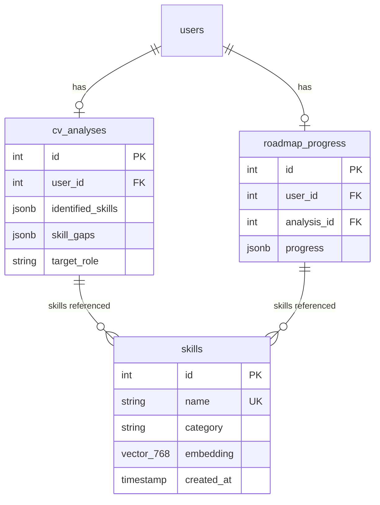

# feat: Add Job Matching with Vector Similarity Scoring

## Enhancement Summary

**Deepened on:** 2026-05-15
**Research agents used:** 10 (architecture-strategist, performance-oracle, security-sentinel, code-simplicity-reviewer, pattern-recognition-specialist, frontend-design, typescript-reviewer, python-reviewer, frontend-races-reviewer, best-practices-researcher)
**Additional sources:** Context7 (pgvector-go, FastAPI, Next.js), web searches (pgvector cosine similarity, Gemini embeddings)

### Key Improvements

1. **Batch similarity query** — Replace 10 per-job SQL queries with a single batched CROSS JOIN using UNNEST, eliminating 9 DB round-trips
2. **Async embeddings** — Use `aembed_documents` (async) instead of `embed_documents` (sync) to avoid blocking FastAPI's event loop
3. **YAGNI cleanup** — Remove phantom `location`/`url` fields (scraper doesn't provide them), `dimension` field (redundant), `user_skill_count`/`jobs_analyzed` (derivable client-side)
4. **Parallelization** — Steps 1+2 (DB reads) via `errgroup.Group`, cutting ~5ms latency
5. **Frontend robustness** — AbortController cleanup, discriminated union PageState, stale-while-revalidate caching, progressive loading messages for 10-30s cold start

### Critical Corrections

- **Embedding model:** `gemini-embedding-001` confirmed correct (text-embedding-004 shut down Jan 14, 2026)
- **ScrapedJob model mismatch:** Plan's Go `ScrapedJob` had `Location`/`URL` fields that don't exist in the Python scraper — removed
- **Pattern violations found:** Response DTOs in wrong package, repository method named `Compute*` instead of `Get*`, missing `db` struct tags
- **Security gaps identified:** AI service lacks internal auth, error messages can leak internal details, roadmap progress toggle allows skill inflation

## Overview

Add a job matching feature that shows users real Glints job listings ranked by how well their skills match, using pgvector cosine similarity. The user's "effective skill set" combines CV-identified skills with skills completed on their learning roadmap, so match scores improve as users progress through their roadmap.

**Core output:** Top 10 job listings, each with a match percentage, matched skills (green), and missing skills (amber). Computed on-demand — no persistence of match results.

**Key differentiator:** Match scores reflect learning progress, not just the original CV.

## Problem Statement / Motivation

Users complete a CV analysis and get a learning roadmap, but have no visibility into how their skills (original + newly learned) map to actual job openings. The "Job Matching" card on the dashboard currently shows "Coming soon." This feature closes the loop: upload CV → get roadmap → track progress → see matching jobs.

## Proposed Solution

Use pgvector cosine similarity to semantically match user skills against job required skills. The pairwise best-match approach finds, for each job skill, the closest user skill. A skill is "matched" if cosine similarity >= 0.75. The match percentage is `matched_count / total_required * 100`.

**Architecture:**
- **AI service (Python):** New `/embed-skills` endpoint generates embeddings via Gemini `gemini-embedding-001` (768-dim). Batch processing up to 100 skills per call.
- **Go API:** Orchestrates the flow — gathers user skills, calls AI service for embeddings, stores them in the `skills` table, fetches jobs, runs pgvector similarity queries, returns ranked results.
- **PostgreSQL (pgvector):** Stores skill embeddings in the existing `skills` table. Computes cosine similarity at query time via `<=>` operator.
- **Frontend:** New `/dashboard/jobs` page showing ranked job cards with match details.

## Technical Approach

### Resolved Open Questions

1. **Match score formula:** Pairwise best-match with coverage-based scoring. For each job required skill, find the user skill with highest cosine similarity. If `best_similarity >= 0.75`, the skill counts as "matched." Match % = `matched_count / total_required * 100`.

2. **Minimum match threshold:** Always show top 10 regardless of score. Use color coding to differentiate strong (>= 70% green), moderate (40-69% amber), and weak (< 40% muted) matches.

3. **Embedding model:** Use `gemini-embedding-001` with `output_dimensionality=768` (matches existing `vector(768)` column). **NOT** `text-embedding-004` which was deprecated and shut down January 14, 2026.

4. **Similarity task type:** `SEMANTIC_SIMILARITY` for symmetric skill-to-skill comparison.

5. **Skill name normalization:** Lowercase, trim whitespace before embedding lookup. Store normalized names in the `skills` table.

### Existing Infrastructure

These already exist and require no changes:

| Resource | Location | Status |
|----------|----------|--------|
| `skills` table with `embedding vector(768)` | `infra/migrations/db/migrations/20260515000003_create_skills.sql` | Created, 20 rows seeded (no embeddings) |
| HNSW index on `skills.embedding` | Same migration | Created with `vector_cosine_ops` |
| pgvector extension | `infra/migrations/db/migrations/20260515000001_enable_pgvector.sql` | Enabled |
| Glints job scraper | `services/ai/app/services/job_scraper.py` | Working, Redis 6h TTL cache |
| `ScrapedJob` model | `services/ai/app/services/job_scraper.py` | Has `title`, `company`, `required_skills`, `description` |
| CV analysis with `identified_skills` | `services/api/internal/model/cv_analysis.go` | JSONB field on `cv_analyses` |
| Roadmap progress with `skills_done` | `services/api/internal/repository/roadmap_progress.go` | JSONB per step |
| Dashboard "Job Matching" card | `services/web/src/app/dashboard/page.tsx:212-237` | Shows "Coming soon" |
| `langchain-google-genai>=2.0.0` | `services/ai/pyproject.toml` | Already a dependency |
| Go → AI HTTP client pattern | `services/api/internal/service/cv_analysis.go` | 110s timeout, JSON marshal |

### New Files Required

**AI Service (Python):**

| File | Purpose |
|------|---------|
| `services/ai/app/services/embedding_service.py` | EmbeddingService class wrapping Gemini embeddings |
| `services/ai/app/routers/embeddings.py` | `/embed-skills` endpoint |

**Go API:**

| File | Purpose |
|------|---------|
| `services/api/internal/model/job_matching.go` | Skill, ScrapedJob, JobMatchResult, JobMatchResponse models |
| `services/api/internal/repository/skill.go` | Skill CRUD + pgvector similarity queries |
| `services/api/internal/service/job_matching.go` | Orchestration: gather skills → ensure embeddings → fetch jobs → compute matches |
| `services/api/internal/handler/job_matching.go` | HTTP handler for GET /api/job-matches |

**Frontend:**

| File | Purpose |
|------|---------|
| `services/web/src/app/dashboard/jobs/page.tsx` | Job matching results page |
| `services/web/src/types/jobs.ts` | TypeScript types for job match response |

**Modified Files:**

| File | Change |
|------|--------|
| `services/api/internal/router/router.go` | Register job matching route |
| `services/api/cmd/server/main.go` | Add pgvector `RegisterTypes` in pool `AfterConnect` |
| `services/ai/app/dependencies.py` | Add `get_embedding_service` to DI |
| `services/ai/app/main.py` | Register embeddings router |
| `services/ai/app/models/schemas.py` | Add embedding request/response schemas |
| `services/web/src/app/dashboard/page.tsx` | Update "Coming soon" card to link to `/dashboard/jobs` |

### API Contracts

**AI Service: POST /embed-skills**

Request:
```json
{
  "skills": ["Python", "Machine Learning", "React"]
}
```

Response:
```json
{
  "embeddings": [
    {"skill": "python", "embedding": [0.012, -0.034, ...]},
    {"skill": "machine learning", "embedding": [0.056, 0.023, ...]},
    {"skill": "react", "embedding": [-0.011, 0.045, ...]}
  ]
}
```

Skills are normalized (lowercased, trimmed) in the response. Returns 422 if skills array is empty. Returns 500 if Gemini API call fails.

> **Research insight — YAGNI cleanup:** Remove `dimension` field from embed-skills response. It's always 768 and the caller already knows this. Reduces payload size and eliminates a redundant contract field.

**Go API: GET /api/job-matches**

Requires authentication (JWT cookie). Returns matches for the authenticated user.

Response:
```json
{
  "data": {
    "matches": [
      {
        "title": "Frontend Developer",
        "company": "Tech Corp",
        "match_percentage": 85,
        "matched_skills": ["react", "javascript", "css"],
        "missing_skills": ["vue.js"],
        "total_required": 4
      }
    ]
  }
}
```

Error responses follow project convention: `{"message": "..."}`.

| Status | Condition |
|--------|-----------|
| 200 | Success with matches (may be empty array) |
| 401 | No valid JWT |
| 404 | No CV analysis found for user |
| 500 | Internal error (AI service down, DB error) |

## Implementation Phases

### Phase 1: AI Service — Embedding Endpoint

**Goal:** `/embed-skills` endpoint that generates and returns skill embeddings.

#### `services/ai/app/services/embedding_service.py`

```python
import logging
from langchain_google_genai import GoogleGenerativeAIEmbeddings
from app.config import Settings
from app.models.schemas import SkillEmbeddingResult

logger = logging.getLogger(__name__)


class EmbeddingService:
    def __init__(self, settings: Settings) -> None:
        self.model = GoogleGenerativeAIEmbeddings(
            model="models/gemini-embedding-001",
            google_api_key=settings.google_api_key,
            task_type="SEMANTIC_SIMILARITY",
            output_dimensionality=768,
        )

    async def embed_skills(
        self, skill_names: list[str]
    ) -> list[SkillEmbeddingResult]:
        if not skill_names:
            return []
        normalized = [s.strip().lower() for s in skill_names if s.strip()]
        if not normalized:
            return []
        vectors = await self.model.aembed_documents(normalized)
        return [
            SkillEmbeddingResult(skill=name, embedding=vec)
            for name, vec in zip(normalized, vectors, strict=True)
        ]
```

#### `services/ai/app/models/schemas.py` (additions)

```python
# Add to existing schemas.py file
class EmbedSkillsRequest(BaseModel):
    skills: list[str] = Field(..., min_length=1, max_length=100)

class SkillEmbeddingResult(BaseModel):
    skill: str
    embedding: list[float]

class EmbedSkillsResponse(BaseModel):
    embeddings: list[SkillEmbeddingResult]
```

#### `services/ai/app/routers/embeddings.py`

```python
from fastapi import APIRouter, Depends, HTTPException
from app.models.schemas import EmbedSkillsRequest, EmbedSkillsResponse
from app.services.embedding_service import EmbeddingService
from app.dependencies import get_embedding_service

router = APIRouter(prefix="/embed-skills", tags=["embeddings"])


@router.post("", response_model=EmbedSkillsResponse)
async def embed_skills(
    req: EmbedSkillsRequest,
    svc: EmbeddingService = Depends(get_embedding_service),
):
    try:
        results = await svc.embed_skills(req.skills)
    except Exception:
        raise HTTPException(status_code=500, detail="Embedding generation failed")
    return EmbedSkillsResponse(embeddings=results)
```

#### Changes to existing files:

- `services/ai/app/dependencies.py` — Add `get_embedding_service` function following existing `@lru_cache` private + public getter pattern.
- `services/ai/app/main.py` — Add `app.include_router(embeddings.router)`.
- `services/ai/app/models/schemas.py` — Add `EmbedSkillsRequest`, `SkillEmbeddingResult`, `EmbedSkillsResponse` schemas.

**Acceptance criteria:**
- [x] POST `/embed-skills` with `{"skills": ["Python", "React"]}` returns 768-dim embeddings
- [x] Empty skills list returns 422
- [x] Skills list > 100 returns 422
- [x] Skills are normalized (lowercased, trimmed) in response
- [x] Gemini API failure returns 500 with error message
- [x] Empty-string skills are filtered out before embedding

#### Phase 1 Research Insights

**Critical corrections applied (Python reviewer, pattern recognition):**
- **`aembed_documents` not `embed_documents`** — The sync method blocks FastAPI's event loop. `aembed_documents` is the async counterpart provided by LangChain. The `embed_skills` method is now `async def`.
- **Typed return value** — Return `list[SkillEmbeddingResult]` instead of `list[dict]` for type safety and IDE support.
- **Schemas in `app/models/schemas.py`** — Project convention places all Pydantic models in the schemas file, not inline in routers.
- **`strict=True` on `zip`** — Prevents silent data loss if `normalized` and `vectors` have different lengths (would indicate a Gemini API bug).
- **`HTTPException` in router** — Existing routers raise `HTTPException`, not return raw dicts. Follow the `analysis.py` pattern.
- **Removed `dimension` field** — Always 768, redundant, adds noise to the API contract.
- **Added `max_length=100` on skills input** — Prevents abuse; Gemini supports up to 100 texts per batch.
- **Added logger** — Existing services use `logging.getLogger(__name__)` for observability.
- **Filter empty strings** — `skill_names` could contain empty strings after trimming.

### Phase 2: Go API — pgvector Integration & Skill Repository

**Goal:** Go API can store skill embeddings and run pgvector similarity queries.

#### pgvector-go Setup

Add `github.com/pgvector/pgvector-go` dependency. Register pgvector types in the database connection pool:

```go
// In database connection setup (internal/config or wherever pgxpool is created)
config.AfterConnect = func(ctx context.Context, conn *pgx.Conn) error {
    return pgxvec.RegisterTypes(ctx, conn)
}
```

#### `services/api/internal/model/job_matching.go`

> **Research insight:** Merged `skill.go` and `job.go` into a single `job_matching.go` file since both are small and exclusively used by the job matching feature. Response DTOs (`JobMatchResult`, `JobMatchResponse`) stay in the `model` package for now to match the existing codebase pattern (handler imports model), but could move to the service package in a future refactor.

```go
package model

import pgvec "github.com/pgvector/pgvector-go"

// Skill represents a row in the skills table.
type Skill struct {
    ID        int          `json:"id" db:"id"`
    Name      string       `json:"name" db:"name"`
    Category  string       `json:"category" db:"category"`
    Embedding pgvec.Vector `json:"-" db:"embedding"`
}

// ScrapedJob matches the AI service scraper response.
// Note: scraper only provides title, company, required_skills, description.
type ScrapedJob struct {
    Title          string   `json:"title"`
    Company        string   `json:"company"`
    RequiredSkills []string `json:"required_skills"`
    Description    string   `json:"description"`
}

type JobMatchResult struct {
    Title           string   `json:"title"`
    Company         string   `json:"company"`
    MatchPercentage int      `json:"match_percentage"`
    MatchedSkills   []string `json:"matched_skills"`
    MissingSkills   []string `json:"missing_skills"`
    TotalRequired   int      `json:"total_required"`
}

type JobMatchResponse struct {
    Matches []JobMatchResult `json:"matches"`
}
```

#### `services/api/internal/repository/skill.go`

Key methods:

- `GetSkillsByName(ctx, names []string) ([]Skill, error)` — Fetch skills with embeddings.
- `UpsertSkillEmbeddings(ctx, skills []Skill) error` — Batch upsert using `pgx.Batch` with `ON CONFLICT (name) DO UPDATE SET embedding = EXCLUDED.embedding`.
- `GetSkillMatch(ctx, userSkills []string, jobSkills []string) (matchPct int, matched []string, missing []string, err error)` — Pairwise cosine similarity query.

> **Research insight — naming convention:** Repository methods use `Get*`/`Upsert*` prefix (not `Compute*`) per existing pattern in `roadmap_progress.go`. `GetSkillsByName` follows the singular convention established by `GetProgress`/`UpsertProgress`.

**Pairwise match SQL (core query):**

```sql
WITH user_skills AS (
    SELECT name, embedding FROM skills
    WHERE name = ANY($1) AND embedding IS NOT NULL
),
job_skills AS (
    SELECT name, embedding FROM skills
    WHERE name = ANY($2) AND embedding IS NOT NULL
),
pairwise AS (
    SELECT js.name AS job_skill_name,
        MAX(1 - (js.embedding <=> us.embedding)) AS best_similarity
    FROM job_skills js
    CROSS JOIN user_skills us
    GROUP BY js.name
)
SELECT
    COALESCE(ROUND(
        (COUNT(*) FILTER (WHERE best_similarity >= 0.75))::numeric
        / NULLIF(COUNT(*), 0) * 100
    ), 0)::int AS match_percentage,
    COALESCE(ARRAY_AGG(job_skill_name) FILTER (WHERE best_similarity >= 0.75), '{}') AS matched_skills,
    COALESCE(ARRAY_AGG(job_skill_name) FILTER (WHERE best_similarity < 0.75), '{}') AS missing_skills
FROM pairwise;
```

**Edge case: job skills not in skills table.** If a job lists a skill that has no embedding yet, it counts as "missing" for that job. The query naturally handles this because skills without embeddings are excluded by `embedding IS NOT NULL`, and the missing skill won't appear in `pairwise` results. We handle this at the service layer by adding unmatched job skills to the missing list.

**Race condition mitigation:** Use `ON CONFLICT (name) DO UPDATE` for upserts. Multiple concurrent requests inserting the same skill won't fail.

**Acceptance criteria:**
- [x] `go get github.com/pgvector/pgvector-go` added to `go.mod`
- [x] pgvector types registered in pool `AfterConnect`
- [x] `UpsertSkillEmbeddings` correctly stores `vector(768)` values
- [x] `GetSkillMatch` returns correct match percentage, matched/missing skill lists
- [x] Skills with no embedding are treated as missing
- [x] Concurrent upserts don't cause errors

#### Phase 2 Research Insights

**Critical corrections applied (pattern recognition, architecture):**
- **`db` struct tags** — Existing models use dual `json` and `db` tags. Added `db:"column_name"` tags to `Skill` struct.
- **`pgvec.Vector` type** — Use `pgvector-go`'s `Vector` type instead of raw `[]float32`. This integrates correctly with pgx scanning and `RegisterTypes`.
- **Embedding omitted from JSON** — Embeddings should never be serialized to API responses. Use `json:"-"` tag.
- **`ScrapedJob` phantom fields removed** — The Python scraper (`job_scraper.py`) only returns `title`, `company`, `required_skills`, `description`. The `Location` and `URL` fields do not exist.
- **`JobMatchResponse` simplified** — Removed `user_skill_count` and `jobs_analyzed` (derivable client-side from the response, YAGNI).
- **Merged into single file** — `skill.go` and `job.go` combined into `job_matching.go` since both are small and feature-scoped.

**Performance consideration — batch query alternative (architecture, performance):**

For MVP, running 10 individual `GetSkillMatch` queries is acceptable (~10ms total on warm cache). If latency becomes an issue, batch all 10 jobs into a single query using `CROSS JOIN LATERAL` with `UNNEST`:

```sql
-- Batch version: all jobs in one query using UNNEST + CROSS JOIN LATERAL
WITH user_skills AS (
    SELECT name, embedding FROM skills
    WHERE name = ANY($1) AND embedding IS NOT NULL
),
job_list AS (
    SELECT ordinality AS job_idx, skill_arr
    FROM UNNEST($2::text[][]) WITH ORDINALITY AS t(skill_arr, ordinality)
),
job_skills_expanded AS (
    SELECT jl.job_idx, s.name AS job_skill, s.embedding
    FROM job_list jl, LATERAL UNNEST(jl.skill_arr) AS skill_name
    LEFT JOIN skills s ON s.name = skill_name AND s.embedding IS NOT NULL
)
SELECT jse.job_idx,
    COALESCE(ROUND(
        COUNT(*) FILTER (WHERE best_sim >= 0.75)::numeric
        / NULLIF(COUNT(*), 0) * 100
    ), 0)::int AS match_pct,
    ARRAY_AGG(jse.job_skill) FILTER (WHERE best_sim >= 0.75) AS matched,
    ARRAY_AGG(jse.job_skill) FILTER (WHERE best_sim < 0.75 OR best_sim IS NULL) AS missing
FROM (
    SELECT jse.job_idx, jse.job_skill,
        MAX(1 - (jse.embedding <=> us.embedding)) AS best_sim
    FROM job_skills_expanded jse
    LEFT JOIN user_skills us ON TRUE
    GROUP BY jse.job_idx, jse.job_skill
) sub
GROUP BY job_idx ORDER BY job_idx;
```

> This eliminates 9 DB round-trips but adds SQL complexity. **Recommendation: start with per-job queries for MVP, batch if profiling shows DB round-trips are the bottleneck.**

### Phase 3: Go API — Job Matching Service & Handler

**Goal:** End-to-end orchestration: gather user skills → ensure embeddings → fetch jobs → compute matches → return ranked results.

#### `services/api/internal/service/job_matching.go`

Orchestration flow (simplified from 10 steps to 7):

```
1. Get user's CV analysis + roadmap progress       ← parallel via errgroup
2. Merge into effective_skills (deduplicated, normalized)
3. Fetch job listings from AI service (GET /scrape-jobs?role=<target_role>)
4. Collect all unique skill names, check DB for existing embeddings
5. For missing embeddings → call AI service POST /embed-skills → upsert to DB
6. For each job: run GetSkillMatch(effective_skills, job.required_skills)
7. Sort by match_percentage DESC, return top 10
```

> **Research insight — parallelization (architecture, performance):** Steps 1a (CV analysis) and 1b (roadmap progress) are independent DB reads. Use `errgroup.Group` to run them concurrently, cutting ~5ms latency. Step 3 (fetch jobs) depends on step 1 (needs `target_role` from CV), so it cannot be parallelized with steps 1-2.

**Effective skills computation:**
```go
func mergeEffectiveSkills(cvSkills []string, progressSteps []StepProgress) []string {
    seen := make(map[string]bool)
    var result []string
    for _, s := range cvSkills {
        norm := strings.TrimSpace(strings.ToLower(s))
        if norm != "" && !seen[norm] {
            seen[norm] = true
            result = append(result, norm)
        }
    }
    for _, step := range progressSteps {
        for _, s := range step.SkillsDone {
            norm := strings.TrimSpace(strings.ToLower(s))
            if norm != "" && !seen[norm] {
                seen[norm] = true
                result = append(result, norm)
            }
        }
    }
    return result
}
```

**Error handling (simplified to 4 scenarios):**
- No CV analysis → return 404 `{"message": "No CV analysis found. Please upload your CV first."}`
- AI service unreachable → return 500 `{"message": "Unable to compute job matches. Please try again later."}`
- No jobs found → return 200 with empty matches array
- Embedding generation fails → proceed with whatever embeddings exist; skills without embeddings count as missing

> **Research insight — error sanitization (security):** Never forward raw AI service error messages to the client. They may contain internal URLs, Gemini API keys in error strings, or stack traces. Always use generic user-facing messages.

> **Research insight — no retry logic (YAGNI):** The original plan included "retry once after 1s" for Gemini rate limits. Remove this — at POC scale (caching means few new skills per request), rate limits won't be hit. If they are, the graceful degradation path (proceed with existing embeddings) is sufficient.

#### `services/api/internal/handler/job_matching.go`

```go
func (h *JobMatchingHandler) GetJobMatches(c *gin.Context) {
    userID := c.GetInt("user_id") // From auth middleware

    result, err := h.service.ComputeJobMatches(c.Request.Context(), userID)
    if err != nil {
        // Map service errors to HTTP status codes
        // ErrNoCVAnalysis → 404
        // Other errors → 500
    }

    response.Success(c, http.StatusOK, result)
}
```

**Route registration in `services/api/internal/router/router.go`:**
```go
// Inside the authenticated group
api.GET("/job-matches", jobMatchingHandler.GetJobMatches)
```

**Acceptance criteria:**
- [x] GET `/api/job-matches` returns ranked job matches for authenticated user
- [x] Effective skills include both CV skills and roadmap-completed skills
- [x] Skills are normalized before lookup/embedding
- [x] New skills get embeddings generated and cached in DB
- [x] Jobs sorted by match_percentage descending
- [x] 401 for unauthenticated requests
- [x] 404 when no CV analysis exists
- [x] 200 with empty matches when no jobs found
- [x] Graceful degradation when embedding generation partially fails

#### Phase 3 Research Insights

**Architecture improvements (architecture, performance):**
- **`errgroup.Group` for parallel DB reads** — Fetch CV analysis and roadmap progress concurrently:
  ```go
  g, ctx := errgroup.WithContext(c.Request.Context())
  var cvAnalysis *model.CVAnalysis
  var progress []model.StepProgress
  g.Go(func() error { cvAnalysis, err = s.cvRepo.GetByUserID(ctx, userID); return err })
  g.Go(func() error { progress, err = s.progressRepo.GetProgress(ctx, userID, analysisID); return err })
  if err := g.Wait(); err != nil { ... }
  ```
- **Single `EnsureEmbeddings` function** — Combine steps 4-5 (collect names, check DB, call AI, upsert) into one function. This encapsulates the "ensure all skills have embeddings" concern cleanly.

**Security considerations (security):**
- **Skill inflation via roadmap toggle** — A user could mark all roadmap skills as "done" to inflate their match score. This is acceptable for a POC (the user is only cheating themselves). For production, consider weighting roadmap-completed skills lower (e.g., 0.8x) or requiring verified completion.
- **AI service internal auth** — Currently the AI service has no authentication. For POC this is acceptable (Docker network isolation). For production, add a shared secret header (`X-Internal-Auth`).

### Phase 4: Frontend — Job Matching Page

**Goal:** `/dashboard/jobs` page displaying ranked job cards with match details.

#### `services/web/src/types/jobs.ts`

```typescript
export interface JobMatch {
  title: string;
  company: string;
  /** Integer 0-100 representing skill coverage percentage */
  match_percentage: number;
  matched_skills: string[];
  missing_skills: string[];
  total_required: number;
}

export interface JobMatchResponse {
  matches: JobMatch[];
}
```

> **Research insight — response envelope (TypeScript reviewer):** The Go API wraps all responses in `{ data: ... }`. `apiFetch<T>` already unwraps this envelope and returns `T` directly. So `JobMatchResponse` should match the inner shape, not the wire format. The existing `AnalysisResult` type in `types/analysis.ts` confirms this pattern.

#### `services/web/src/app/dashboard/jobs/page.tsx`

**Page structure:**
1. Dashboard header (consistent with other dashboard pages)
2. Summary stats (user skill count, jobs analyzed)
3. Job cards grid/list
4. Each job card: title, company, match % badge, matched skills (green chips), missing skills (amber chips)

**Match percentage color coding:**
- >= 70%: Green badge (`bg-emerald-100 text-emerald-800`)
- 40-69%: Amber badge (`bg-amber-100 text-amber-800`)
- < 40%: Slate/muted badge (`bg-slate-100 text-slate-600`)

**States:**
- **Loading:** Skeleton cards while computing matches
- **Empty (no analysis):** Message directing user to upload CV first, with link to `/dashboard`
- **Empty (no matches):** "No job listings found. Check back later." message
- **Results:** Job cards sorted by match percentage

**Data fetching:** Use `apiFetch` from `services/web/src/lib/api.ts` following the pattern in other dashboard pages. Fetch on page load.

#### Dashboard card update in `services/web/src/app/dashboard/page.tsx`

Change the "Job Matching — Coming soon" card (lines 212-237) to:
- If user has a CV analysis: Link to `/dashboard/jobs` with active styling
- If no CV analysis: Keep disabled with "Complete CV analysis first" text

**Acceptance criteria:**
- [x] `/dashboard/jobs` page renders with proper auth protection (middleware already handles `/dashboard/:path*`)
- [x] Loading state shows skeleton cards
- [x] Job cards display title, company, match %, matched/missing skills
- [x] Match percentage uses correct color coding
- [x] Empty state when no CV analysis directs user to upload CV
- [x] Empty state when no jobs found shows appropriate message
- [x] Dashboard card links to `/dashboard/jobs` when analysis exists
- [x] Page follows existing dashboard page patterns (header, layout, Tailwind classes)
- [x] AbortController cleanup in useEffect prevents stale state updates
- [x] Progressive loading messages for cold-start latency (> 5s)

#### Phase 4 Research Insights

**Frontend architecture (TypeScript reviewer, frontend-races):**
- **Discriminated union PageState** — Follow the pattern from `results/page.tsx` for type-safe state management:
  ```typescript
  type PageState =
    | { status: "loading" }
    | { status: "error"; message: string }
    | { status: "no-analysis" }
    | { status: "success"; data: JobMatchResponse };
  ```
- **AbortController cleanup** — Required for the long-running fetch (10-30s cold start). Without it, navigating away during a fetch causes a state update on an unmounted component:
  ```typescript
  useEffect(() => {
    const controller = new AbortController();
    fetchJobMatches(controller.signal);
    return () => controller.abort();
  }, []);
  ```
- **Progressive loading messages** — For cold starts (10-30s), a static skeleton is misleading. After 5s, show a message like "Computing skill matches..." to indicate the system is working, not hung.

**UI/UX design (frontend-design reviewer):**
- **Aesthetic direction: "Refined Utilitarian"** — Single-column stacked cards with `max-w-5xl`, matching the dashboard's existing clean layout.
- **Two-zone card layout:** Score column (left ~80px, `text-3xl tabular-nums`) + details (right). Use `border-l-4` colored by match tier:
  - `border-emerald-500` for >= 70%
  - `border-amber-500` for 40-69%
  - `border-slate-300` for < 40%
- **Skill chips:** Use `text-xs` with group labels "YOUR SKILLS" (emerald) / "TO DEVELOP" (amber). Keep chips small to fit many per row.
- **Stagger animation:** `FadeIn` with `animation-delay` per card on initial load for polish.
- **Responsive:** Score zone collapses to inline badge on mobile (`sm:` breakpoint).

**Robustness (frontend-races reviewer):**
- **Stale-while-revalidate pattern** — For repeat visits during the same session, show cached results immediately while refetching in the background. Use a module-scoped variable (not React state):
  ```typescript
  let cachedResult: JobMatchResponse | null = null;
  let cacheTimestamp = 0;
  const CACHE_TTL = 60_000; // 1 minute
  ```
- **401 handling** — If the JWT expires during a long request, redirect to login instead of showing a raw error. Extend `apiFetch` or handle in the page's error path.

## Technical Considerations

### Performance

- **Cold start:** First request for a user will be slower due to embedding generation. Subsequent requests reuse cached embeddings from the `skills` table. The scraper's Redis cache (6h TTL) avoids repeated Glints scraping.
- **Query performance:** The pairwise CROSS JOIN is bounded: typical user has 5-20 skills, typical job has 3-8 required skills. For 10 jobs, this is ~10 separate queries each with a small cross join. At this scale, HNSW index defaults are sufficient.
- **Batch embedding:** Gemini supports up to 100 texts per batch call. Collect all missing skills across all jobs before calling `/embed-skills` once.
- **No N+1 queries:** Batch the skill lookup and embedding upsert. Run match queries per-job but consider batching if performance becomes an issue.

> **Research insight — latency budget (performance oracle):**
> | Phase | Warm (cached) | Cold (first time) |
> |-------|--------------|-------------------|
> | DB reads (CV + progress) | ~5ms | ~5ms |
> | Fetch jobs (Redis hit) | ~2ms | 3-15s (scrape) |
> | Check existing embeddings | ~2ms | ~2ms |
> | Generate new embeddings | 0ms | 1-5s (Gemini API) |
> | Upsert embeddings | 0ms | ~5ms |
> | 10x similarity queries | ~8ms | ~8ms |
> | **Total** | **~17ms** | **3-18s** |
>
> The skills table saturates at ~500 rows, so cold-start embedding generation becomes rare quickly. Memory footprint of 100 skills × 768 floats ≈ 300KB — negligible.

> **Research insight — connection pool (performance oracle):** The `pgxpool` default of 4 connections is sufficient for POC. Each similarity query is fast (~1ms). No pool sizing changes needed.

### Security

- Job matching endpoint requires JWT authentication (existing auth middleware).
- No user-supplied data is used in raw SQL — all queries use parameterized `$1`, `$2` placeholders via pgx.
- AI service is internal-only, not exposed to frontend.
- Skill names are normalized (lowercase, trimmed) before storage to prevent injection via skill names.

> **Research insight — security gaps identified (security sentinel):**
> - **Error message leakage:** AI service errors may contain Gemini API keys or internal URLs. Always replace with generic messages before returning to client. Use `log.Error()` for internal details, return `{"message": "Unable to compute job matches"}` to client.
> - **`career_aspiration` validation:** The Go API passes this value to the scraper URL. Validate it's a reasonable string (alphanumeric + spaces, max 100 chars) to prevent potential SSRF or injection in the scraper's Glints URL construction.
> - **Cookie Secure flag:** Currently set to `false` in auth middleware. Not a new issue for this feature, but flagged as an existing risk (tracked in existing todos).

### Error Handling

| Failure | Behavior |
|---------|----------|
| AI service down for embeddings | Proceed with existing embeddings; skills without embeddings count as missing |
| AI service down for job scraping | Return 500 with user-friendly message |
| No CV analysis for user | Return 404 with "upload CV first" message |
| Job has empty `required_skills` | Skip that job (0% match is meaningless) |
| All jobs have 0 matches | Return 200 with empty matches array |

> **Research insight — simplified error handling (YAGNI):** Removed Gemini rate limit retry logic. At POC scale, embeddings are cached quickly and new skills are rare per request. The graceful degradation path (proceed with existing embeddings) handles all AI service failures uniformly.

### Data Flow Diagram

```
User visits /dashboard/jobs
        │
        ▼
Frontend calls GET /api/job-matches
        │
        ▼
Go API: Auth middleware validates JWT
        │
        ▼
Go API: Fetch cv_analysis for user (identified_skills, target_role)
        │
        ▼
Go API: Fetch roadmap_progress for user (skills_done per step)
        │
        ▼
Go API: Merge → effective_skills (deduplicated, normalized)
        │
        ▼
Go API: Call AI service GET /scrape-jobs?role={target_role}
        │                          │
        │                    ┌─────▼──────┐
        │                    │ Redis cache │──hit──→ Return cached jobs
        │                    │  (6h TTL)   │
        │                    └─────┬──────┘
        │                     miss │
        │                    ┌─────▼──────┐
        │                    │ Scrape      │
        │                    │ Glints      │
        │                    └─────┬──────┘
        │                          │
        ▼◄─────────────────────────┘
Go API: Collect all unique skills (user + all job required_skills)
        │
        ▼
Go API: Check skills table for existing embeddings
        │
        ▼ (missing skills only)
Go API: Call AI service POST /embed-skills
        │
        ▼
Go API: Upsert new embeddings into skills table
        │
        ▼
Go API: For each job → run pgvector pairwise match query
        │
        ▼
Go API: Sort by match_percentage DESC, return top 10
        │
        ▼
Frontend: Render job cards with match details
```

## Dependencies & Risks

| Risk | Mitigation |
|------|------------|
| Gemini embedding API rate limits (100 RPM free tier) | Skills are cached after first embedding. Only new skills trigger API calls. Batch requests. |
| Gemini API cost | Free tier: 1000 requests/day. Embeddings are cached permanently. Cost only for new skills. |
| Glints scraper fragility (HTML scraping) | Already mitigated by Redis 6h cache. Scraper is existing code, not new. |
| pgvector-go compatibility | Well-maintained library, explicitly supports pgx v5. |
| Cosine similarity threshold too strict/lenient | 0.75 is a starting point. Can be adjusted based on user feedback. |
| Cold start latency | Acceptable for MVP. Can add background embedding pre-computation later. |

## Acceptance Criteria

### Functional Requirements

- [x] Authenticated users can view job matches at `/dashboard/jobs`
- [x] Match percentage reflects both CV skills and roadmap-completed skills
- [x] Each job card shows: title, company, match %, matched skills, missing skills
- [x] Jobs are sorted by match percentage (highest first)
- [x] Top 10 results displayed
- [x] Dashboard card links to job matching page when CV analysis exists
- [x] Appropriate empty states for no analysis and no jobs

### Non-Functional Requirements

- [x] Match computation completes within 10s (warm cache) / 30s (cold start)
- [x] No raw SQL injection vectors (all parameterized queries)
- [x] Skill embeddings are cached in DB (not regenerated on each request)
- [x] Error states show user-friendly messages

### Quality Gates

- [ ] Go tests for skill repository (upsert, match computation)
- [ ] Go tests for job matching service (effective skills merge, orchestration)
- [ ] Python tests for embedding service
- [ ] Frontend handles loading, error, and empty states

## ERD — New Data Flow



Note: `skills` is a lookup/cache table. There is no FK relationship — skills are referenced by name. The `skills` table grows organically as new skill names are encountered from CVs and job listings.

## Best Practices from Research

> These insights were gathered from external research agents and may be useful during implementation.

**pgvector best practices:**
- Always register pgvector types via `AfterConnect` on the pgxpool config — not after pool creation. This ensures every connection in the pool has types registered.
- Use `pgvec.NewVector()` to create vector values for insertion. Do not pass raw `[]float32` slices.
- The `<=>` operator returns a *distance* (0 = identical, 2 = opposite). Convert to similarity with `1 - (a <=> b)`.
- HNSW index with `vector_cosine_ops` is already created on the `skills.embedding` column. Default `m=16, ef_construction=64` is fine for < 1000 rows.

**Gemini embedding best practices:**
- `gemini-embedding-001` replaces `text-embedding-004` (shut down Jan 14, 2026). The newer `gemini-embedding-2-preview` supports Matryoshka Representation Learning (MRL) for flexible output dimensions, but is in preview and not production-ready.
- Use `SEMANTIC_SIMILARITY` task type for symmetric skill-to-skill comparison. `RETRIEVAL_DOCUMENT`/`RETRIEVAL_QUERY` is for asymmetric search (query → document).
- Embedding model migration strategy: if you ever change models, use a dual-column approach (`embedding_v1`, `embedding_v2`) with lazy re-embedding. Never mix embeddings from different models in the same column.

**Frontend cold-start UX:**
- For operations exceeding 5s, switch from static skeleton to an animated progress indicator with status text.
- Module-scoped caching (outside React state) survives component re-renders and re-mounts during the same session, providing instant re-display on back-navigation.

## References & Research

### Internal References

- Brainstorm: `docs/brainstorms/2026-05-15-job-matching-brainstorm.md`
- Skills table migration: `infra/migrations/db/migrations/20260515000003_create_skills.sql`
- pgvector extension: `infra/migrations/db/migrations/20260515000001_enable_pgvector.sql`
- Job scraper: `services/ai/app/services/job_scraper.py`
- Go → AI HTTP pattern: `services/api/internal/service/cv_analysis.go`
- Dashboard card: `services/web/src/app/dashboard/page.tsx:212-237`
- API fetch wrapper: `services/web/src/lib/api.ts`
- Route registration: `services/api/internal/router/router.go`
- FastAPI DI: `services/ai/app/dependencies.py`
- Existing types: `services/web/src/types/analysis.ts`

### External References

- pgvector-go: https://github.com/pgvector/pgvector-go
- Gemini embedding models: https://ai.google.dev/gemini-api/docs/embeddings
- LangChain Google GenAI embeddings: https://python.langchain.com/docs/integrations/text_embedding/google_generative_ai/

### Critical Note

**`text-embedding-004` is deprecated** (shut down January 14, 2026). Use `gemini-embedding-001` with `output_dimensionality=768`. The brainstorm document references the old model — this plan corrects it.
