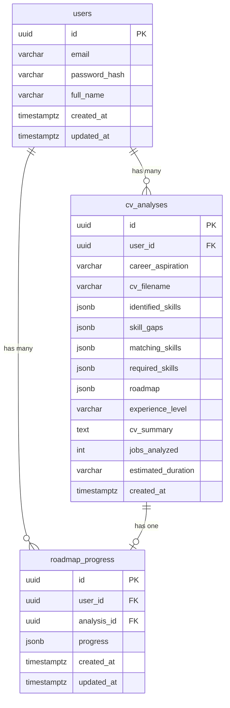

# feat: Add Interactive Roadmap Progress Tracking

## Enhancement Summary

**Deepened on:** 2026-05-15
**Sections enhanced:** 9
**Review agents used:** architecture-strategist, security-sentinel, performance-oracle, code-simplicity-reviewer, data-integrity-guardian, data-migration-expert, julik-frontend-races-reviewer, pattern-recognition-specialist, kieran-typescript-reviewer, frontend-design

### Key Improvements

1. **Revised migration**: Reuse existing `trigger_set_updated_at()`, add `CHECK (jsonb_typeof(progress) = 'object')`, add `analysis_id` index
2. **Revised concurrency model**: Use `SELECT FOR UPDATE` inside explicit pgx transaction (not atomic SQL), with validation *outside* the transaction to minimize lock hold time
3. **Revised repository pattern**: Rename toggle methods to `UpsertProgress` — service computes full state, repo just writes it (keeps business logic in service layer per codebase convention)
4. **Add sentinel errors**: `ErrProgressNotFound` in repository, validation errors in service — matching existing codebase pattern
5. **Add `GetRoadmapByID` repo method**: Fetch only `roadmap` column instead of all 14 columns per PATCH
6. **Revised TypeScript types**: `ToggleRequest` as discriminated union, add `error` state to `PageState`
7. **Frontend race condition guards**: AbortController for analysis switching, debounced PATCH batching, `analysisId` embedded in state for stale response detection
8. **Revised handler validation**: Conditional field validation (value required for skills, index required for resources), generic error messages to clients
9. **UI refinements**: Auto-expand current step, state-based timeline indicators, emerald for completion color, proper ARIA roles

### New Considerations Discovered

- **Pre-existing cookie bug**: `SetSameSite()` called after `SetCookie()` in `auth.go` — SameSite attribute not applied (out of scope but noted)
- **Pre-existing error leakage**: `err.Error()` passed to client in several existing handlers (out of scope but noted)
- **No rate limiting exists** on any endpoint — consider adding for PATCH endpoint at minimum

---

## Overview

Add a `/dashboard/roadmap` page where users can track progress through their AI-generated learning roadmap by checking off individual skills and resources. Steps auto-complete when all sub-items are done. Progress is persisted server-side in PostgreSQL.

## Problem Statement / Motivation

The AI-generated learning roadmap is currently display-only — users see it once after analysis and have no way to track which skills they've learned or which resources they've completed. This makes the roadmap a one-time output rather than an ongoing tool. Adding progress tracking turns the roadmap into an actionable learning plan.

## Proposed Solution

New `roadmap_progress` table with JSONB progress column, two new API endpoints (GET + PATCH), and a new frontend page. Follows all existing codebase patterns (Clean Architecture, JSONB storage, Tailwind UI).

### Key Design Decisions

| Decision | Choice | Rationale |
|---|---|---|
| Concurrency | `SELECT FOR UPDATE` in pgx transaction | Simpler than atomic JSONB SQL; Go-level modification is easier to test and debug |
| PATCH response | Full progress JSONB + percentage | Frontend always has fresh state; knows if auto-completion happened |
| Progress formula | Item-level: `(skills_done + resources_done) / (total_skills + total_resources) * 100` | Smoother than step-level; more motivating for users |
| Validation | Server-side against original roadmap | Every PATCH loads `cv_analyses.roadmap` to validate step/skill/resource exists |
| Frontend updates | Optimistic with debounced PATCH + rollback on error | Feels instant; batches rapid clicks; checkbox reverts if PATCH fails |
| Empty steps | Auto-completed (0/0 = complete) | Steps with no checkable items shouldn't block progress |
| Upsert | `INSERT ... ON CONFLICT DO NOTHING` + fallthrough to `SELECT FOR UPDATE` | Avoids first-toggle race where two concurrent inserts could overwrite each other |
| Toggle logic placement | Service layer, not repository | Matches codebase convention: repos are pure data access, services handle business logic |

## Technical Approach

### Phase 1: Database Migration

**File:** `infra/migrations/db/migrations/20260515000005_create_roadmap_progress.sql`

```sql
-- migrate:up
CREATE TABLE roadmap_progress (
    id UUID PRIMARY KEY DEFAULT gen_random_uuid(),
    user_id UUID NOT NULL REFERENCES users(id) ON DELETE CASCADE,
    analysis_id UUID NOT NULL REFERENCES cv_analyses(id) ON DELETE CASCADE,
    progress JSONB NOT NULL DEFAULT '{}'
        CHECK (jsonb_typeof(progress) = 'object'),
    created_at TIMESTAMPTZ NOT NULL DEFAULT NOW(),
    updated_at TIMESTAMPTZ NOT NULL DEFAULT NOW(),
    UNIQUE(user_id, analysis_id)
);

CREATE INDEX idx_roadmap_progress_analysis_id ON roadmap_progress(analysis_id);

CREATE TRIGGER set_roadmap_progress_updated_at
    BEFORE UPDATE ON roadmap_progress
    FOR EACH ROW
    EXECUTE FUNCTION trigger_set_updated_at();

-- migrate:down
DROP TRIGGER IF EXISTS set_roadmap_progress_updated_at ON roadmap_progress;
DROP TABLE IF EXISTS roadmap_progress;
```

#### Research Insights (Phase 1)

**Changes from original plan:**
- Added `CHECK (jsonb_typeof(progress) = 'object')` — matches the `CHECK` constraint pattern on all JSONB columns in `cv_analyses` migration. Prevents storing arrays, strings, or numbers in the column.
- Added `idx_roadmap_progress_analysis_id` index — needed for FK cascade delete lookups on `analysis_id`. Without this, deleting a `cv_analyses` row triggers a sequential scan on `roadmap_progress`.
- Reuses existing `trigger_set_updated_at()` function from `20260515000002_create_users.sql` instead of creating a duplicate `update_roadmap_progress_updated_at()`. Simplifies down migration (no function to drop).

**Cascade behavior verified:**
- `DELETE users` → `DELETE cv_analyses` → `DELETE roadmap_progress` (two-level cascade, correct and GDPR-compliant)
- `ON DELETE CASCADE` from both FKs is consistent with existing `cv_analyses` pattern

**Progress JSONB shape:**
```json
{
  "1": {
    "skills_done": ["Python", "Pandas"],
    "resources_done": [0, 2],
    "completed_at": "2026-05-15T10:30:00Z"
  },
  "2": {
    "skills_done": [],
    "resources_done": [1],
    "completed_at": null
  }
}
```

### Phase 2: Go Backend (handler -> service -> repository)

#### 2.1 Model

**File:** `services/api/internal/model/roadmap_progress.go`

```go
type RoadmapProgress struct {
    ID         string          `json:"id" db:"id"`
    UserID     string          `json:"user_id" db:"user_id"`
    AnalysisID string          `json:"analysis_id" db:"analysis_id"`
    Progress   json.RawMessage `json:"progress" db:"progress"`
    CreatedAt  time.Time       `json:"created_at" db:"created_at"`
    UpdatedAt  time.Time       `json:"updated_at" db:"updated_at"`
}
```

**Pattern compliance:** Uses `string` for UUIDs (not `uuid.UUID`), `json.RawMessage` for JSONB, `time.Time` for timestamps, dual `json`/`db` struct tags — all matching existing `model/cv_analysis.go`.

#### 2.2 Repository

**File:** `services/api/internal/repository/roadmap_progress.go`

```go
var ErrProgressNotFound = errors.New("progress not found")

type RoadmapProgressRepository struct {
    db *pgxpool.Pool
}

func NewRoadmapProgressRepository(db *pgxpool.Pool) *RoadmapProgressRepository {
    return &RoadmapProgressRepository{db: db}
}
```

Two methods (revised from three):

- `GetProgress(ctx, analysisID, userID)` — SELECT with user_id filter. Returns empty progress (`{}`) if no row exists (not 404).
- `UpsertProgress(ctx, userID, analysisID string, progress json.RawMessage)` — Atomic upsert: the service layer computes the full new progress state, and the repo writes it. Uses an explicit pgx transaction with `SELECT FOR UPDATE` for safe read-modify-write:

```go
func (r *RoadmapProgressRepository) UpsertProgress(
    ctx context.Context, userID, analysisID string, newProgress json.RawMessage,
) error {
    tx, err := r.db.Begin(ctx)
    if err != nil {
        return err
    }
    defer tx.Rollback(ctx)

    // Try INSERT first (handles first-toggle case)
    _, err = tx.Exec(ctx,
        `INSERT INTO roadmap_progress (user_id, analysis_id, progress)
         VALUES ($1, $2, $3)
         ON CONFLICT (user_id, analysis_id) DO UPDATE
         SET progress = $3, updated_at = NOW()`,
        userID, analysisID, newProgress,
    )
    if err != nil {
        return err
    }

    return tx.Commit(ctx)
}
```

**Note:** For the MVP, the service layer does a `GetProgress` + modify in Go + `UpsertProgress`. If concurrent races become a real concern, upgrade to `SELECT FOR UPDATE` within a single transaction that reads, modifies, and writes.

#### Research Insights (Phase 2.2)

**Revised from original plan:**
- **Renamed methods**: `UpsertToggleSkill`/`UpsertToggleResource` → `UpsertProgress`. Toggle logic (add/remove skill from array, evaluate completion) stays in the service layer. The repo receives the already-computed JSONB and writes it. This matches the existing convention where repositories are pure data-access (`SaveAnalysis` receives a fully-formed model).
- **Added sentinel error**: `ErrProgressNotFound` follows the pattern of `ErrAnalysisNotFound` and `ErrUserNotFound` in existing repositories.
- **Transaction pattern**: This is the first transaction usage in the codebase. The `SELECT FOR UPDATE` + `UPDATE` must happen within a single `tx` — using separate `r.db` calls would release the lock immediately after SELECT, defeating the purpose.

**Add `GetRoadmapByID` to cv_analysis repository (new method):**

```go
// In repository/cv_analysis.go — fetch only the roadmap column
func (r *CVAnalysisRepository) GetRoadmapByID(
    ctx context.Context, id, userID string,
) (json.RawMessage, error) {
    var roadmap json.RawMessage
    err := r.db.QueryRow(ctx,
        `SELECT roadmap FROM cv_analyses WHERE id = $1 AND user_id = $2`,
        id, userID,
    ).Scan(&roadmap)
    if err != nil {
        if errors.Is(err, pgx.ErrNoRows) {
            return nil, ErrAnalysisNotFound
        }
        return nil, err
    }
    return roadmap, nil
}
```

This avoids fetching all 14 columns from `cv_analyses` on every PATCH — reduces data transfer by ~80%.

#### 2.3 Service

**File:** `services/api/internal/service/roadmap_progress.go`

```go
var (
    ErrInvalidStep     = errors.New("step not found in roadmap")
    ErrInvalidSkill    = errors.New("skill not found in step")
    ErrInvalidResource = errors.New("resource index out of bounds")
    ErrInvalidType     = errors.New("type must be skill or resource")
)

type RoadmapProgressService struct {
    progressRepo *repository.RoadmapProgressRepository
    analysisRepo *repository.CVAnalysisRepository
}

func NewRoadmapProgressService(
    progressRepo *repository.RoadmapProgressRepository,
    analysisRepo *repository.CVAnalysisRepository,
) *RoadmapProgressService {
    return &RoadmapProgressService{
        progressRepo: progressRepo,
        analysisRepo: analysisRepo,
    }
}
```

Methods:

- `GetProgress(ctx, analysisID, userID)` — Pass-through to repo.
- `ToggleItem(ctx, userID, analysisID string, req ToggleRequest)` — Core business logic:
  1. Load roadmap via `analysisRepo.GetRoadmapByID()` (only the roadmap column)
  2. Parse the roadmap JSONB into `[]RoadmapStep`
  3. Validate: step exists, skill/resource exists in that step (reject with sentinel errors)
  4. Load current progress via `progressRepo.GetProgress()`
  5. Toggle the item in Go (add/remove from skills_done or resources_done array)
  6. Re-evaluate step completion (all skills + resources done? → set `completed_at`; any unchecked? → clear `completed_at`)
  7. Call `progressRepo.UpsertProgress()` with the full new progress JSONB
  8. Compute and return `progress_percentage`

#### Research Insights (Phase 2.3)

**Key changes from original:**
- Validation happens OUTSIDE any transaction — invalid requests (wrong step number, wrong skill name) never acquire a database lock
- Toggle logic lives entirely in the service — the repo receives the computed result
- Uses `GetRoadmapByID` instead of `GetAnalysisByID` to avoid fetching unnecessary columns
- Service-level sentinel errors added for proper error mapping in handler

**Validation errors** (return 422):
- Step number `< 1` or `> len(roadmap)` → `ErrInvalidStep`
- Skill name not found in step's `skills_covered` (exact match) → `ErrInvalidSkill`
- Resource index `< 0` or `>= len(resources)` → `ErrInvalidResource`
- Type is not `"skill"` or `"resource"` → `ErrInvalidType`
- When `type=skill`: `value` is required, `index` is ignored
- When `type=resource`: `index` is required, `value` is ignored

**Division by zero guard:** If total_skills + total_resources == 0 for the entire roadmap, return 100% (all steps are auto-completed).

#### 2.4 Handler

**File:** `services/api/internal/handler/roadmap_progress.go`

```go
type RoadmapProgressHandler struct {
    progressService *service.RoadmapProgressService
}

func NewRoadmapProgressHandler(s *service.RoadmapProgressService) *RoadmapProgressHandler {
    return &RoadmapProgressHandler{progressService: s}
}
```

**Request struct (private):**
```go
type toggleProgressRequest struct {
    Step  int    `json:"step" binding:"required,min=1"`
    Type  string `json:"type" binding:"required,oneof=skill resource"`
    Value string `json:"value" binding:"max=200"`
    Index *int   `json:"index" binding:"omitempty,min=0"`
    Done  bool   `json:"done"`
}
```

**Conditional validation in handler (after ShouldBindJSON):**
```go
switch req.Type {
case "skill":
    if req.Value == "" {
        response.Error(c, http.StatusBadRequest, "value is required when type is skill")
        return
    }
case "resource":
    if req.Index == nil {
        response.Error(c, http.StatusBadRequest, "index is required when type is resource")
        return
    }
}
```

**Error mapping:**
```go
if errors.Is(err, service.ErrInvalidStep) || errors.Is(err, service.ErrInvalidSkill) ||
   errors.Is(err, service.ErrInvalidResource) || errors.Is(err, service.ErrInvalidType) {
    response.Error(c, http.StatusUnprocessableEntity, err.Error())
    return
}
if errors.Is(err, repository.ErrAnalysisNotFound) {
    response.Error(c, http.StatusNotFound, "Analysis not found")
    return
}
log.Printf("Failed to toggle progress for analysis %s: %v", id, err)
response.Error(c, http.StatusInternalServerError, "Failed to update progress")
```

#### Research Insights (Phase 2.4)

**Security improvements:**
- Added `max=200` on `Value` field to prevent oversized strings
- Added conditional field validation: `value` required for skills, `index` required for resources
- **Generic error messages to client** for 500 errors — don't pass `err.Error()` which could leak internal details (log it instead)
- Sentinel errors for validation get their message passed through (user-safe strings)

**Response shape:**
```json
{
  "data": {
    "progress": { "1": { "skills_done": [...], "resources_done": [...], "completed_at": "..." } },
    "progress_percentage": 42.5
  }
}
```

#### 2.5 Router Wiring

**File:** `services/api/internal/router/router.go`

Add to the existing `protected` group. Note: `cvAnalysisRepo` is already instantiated at line 23, so reuse it:
```go
progressRepo := repository.NewRoadmapProgressRepository(db)
progressService := service.NewRoadmapProgressService(progressRepo, cvAnalysisRepo)
progressHandler := handler.NewRoadmapProgressHandler(progressService)

protected.GET("/ai/analyses/:id/progress", progressHandler.GetProgress)
protected.PATCH("/ai/analyses/:id/progress", progressHandler.ToggleProgress)
```

### Phase 3: Frontend

#### 3.1 TypeScript Types

**File:** `services/web/src/types/analysis.ts` (extend existing)

```typescript
export interface StepProgress {
  skills_done: string[];
  resources_done: number[];
  completed_at: string | null;
}

export interface RoadmapProgressData {
  progress: Record<string, StepProgress>;
  progress_percentage: number;
}

// Discriminated union — enforces correct fields per type
interface ToggleRequestBase {
  step: number;
  done: boolean;
}

interface ToggleSkillRequest extends ToggleRequestBase {
  type: "skill";
  value: string;
}

interface ToggleResourceRequest extends ToggleRequestBase {
  type: "resource";
  index: number;
}

export type ToggleRequest = ToggleSkillRequest | ToggleResourceRequest;
```

#### Research Insights (Phase 3.1)

**Revised from original:**
- `ToggleRequest` changed from single interface with optional fields to a **discriminated union**. The original allowed invalid states like `{ type: "skill", index: 3 }` (missing `value`, has irrelevant `index`). The union enforces correct field presence at compile time.
- `Record<string, StepProgress>` — guard lookups at call sites since accessing a missing key returns `undefined` at runtime despite TypeScript saying `StepProgress`.

#### 3.2 Roadmap Page

**File:** `services/web/src/app/dashboard/roadmap/page.tsx`

Client component. Page states (revised with error state and analysisId):

```typescript
type PageState =
  | { status: "loading" }
  | { status: "empty" }
  | { status: "error"; message: string }
  | { status: "loading-progress"; analysisId: string; analyses: AnalysisResult[] }
  | { status: "ready"; analysisId: string; analyses: AnalysisResult[]; selected: AnalysisResult; progress: RoadmapProgressData };
```

**Data fetching on mount:**
1. `GET /api/ai/analyses` — if empty, show empty state with CTA
2. Select latest analysis (index 0, already sorted DESC)
3. `GET /api/ai/analyses/:id/progress` — load progress

**On analysis switch (dropdown):**
1. Abort any in-flight progress fetch AND any in-flight PATCH
2. Clear any debounced PATCH timer
3. Update selected analysis
4. `GET /api/ai/analyses/:id/progress` for the new selection

**On checkbox toggle (optimistic with debounce):**
1. Immediately update local state (toggle the checkbox)
2. Accumulate toggles in a ref; debounce PATCH by 300ms
3. On debounce fire: `PATCH /api/ai/analyses/:id/progress` with latest toggle
4. On success: update local state with server response (authoritative)
5. On error: revert local state, show error message inline

#### Research Insights (Phase 3.2)

**Race condition guards (from frontend races review):**

Essential refs for managing async operations:
```typescript
const progressFetchAbortRef = useRef<AbortController | null>(null);
const patchAbortRef = useRef<AbortController | null>(null);
const patchTimerRef = useRef<ReturnType<typeof setTimeout> | null>(null);
```

**Analysis switch — stale response prevention:**
```typescript
function fetchProgress(analysisId: string) {
  progressFetchAbortRef.current?.abort();
  const controller = new AbortController();
  progressFetchAbortRef.current = controller;

  apiFetch<ProgressResponse>(`/api/ai/analyses/${analysisId}/progress`, {
    signal: controller.signal,
  })
    .then(res => {
      if (controller.signal.aborted) return;
      setState(prev => {
        // Only apply if still on this analysis
        if ('analysisId' in prev && prev.analysisId === analysisId) {
          return { ...prev, status: "ready", progress: res.data };
        }
        return prev;
      });
    })
    .catch(err => {
      if (controller.signal.aborted) return;
      setState({ status: "error", message: err.message });
    });
}
```

**Unmount cleanup:**
```typescript
useEffect(() => {
  const controller = new AbortController();
  // ... initial fetch ...

  return () => {
    controller.abort();
    progressFetchAbortRef.current?.abort();
    patchAbortRef.current?.abort();
    if (patchTimerRef.current) clearTimeout(patchTimerRef.current);
  };
}, []);
```

**UI design improvements:**

| Element | Original | Revised |
|---|---|---|
| Container width | `max-w-7xl` (too wide for timeline) | `max-w-4xl` |
| Default expand state | All expanded | Auto-expand first incomplete step only |
| Step circle (complete) | Blue | `bg-emerald-500` with check icon |
| Step circle (in-progress) | Blue | `bg-blue-600` with step number |
| Step circle (future) | Blue | `bg-slate-200 text-slate-500` |
| Progress bar color | Unspecified | Emerald-500 (completion semantic) |
| Duration badges | `bg-slate-100` | `bg-amber-50 text-amber-700` for distinctiveness |
| Step progress counter | Not shown | Show "4/6 items" on collapsed cards |
| Accessibility | Not specified | `role="checkbox"`, `aria-checked`, `role="progressbar"`, `aria-expanded` on cards |
| Error feedback | Silent rollback | Inline error message ("Could not save progress") |

**Layout structure (revised):**
```
Header (same as dashboard)
├── Analysis selector dropdown (only shown when analyses.length > 1)
├── Overall progress bar (emerald, segmented by step)
└── Roadmap timeline (vertical, max-w-4xl)
    ├── Step 1 card (auto-expanded if first incomplete)
    │   ├── Step circle (emerald/blue/slate based on state)
    │   ├── Title + "4/6 items" counter + duration badge (amber)
    │   ├── Description
    │   ├── Skills checkboxes (emerald when checked)
    │   └── Resources checkboxes (blue when checked)
    ├── Step 2 card (collapsed, shows progress counter)
    └── Step N card
```

**Inline components** (defined in same file, following existing pattern from analyze page):
- `AnalysisSelector` — dropdown (hidden when only 1 analysis), label format: `"${career_aspiration} — ${formatDate(created_at)}"`
- `ProgressBar` — horizontal bar with emerald fill, percentage text, `role="progressbar"` with ARIA attributes
- `RoadmapStepCard` — expandable card with state-based step circle, progress counter, `aria-expanded`, completion animation
- `EmptyRoadmap` — centered CTA card with icon + heading + subtext linking to `/dashboard/analyze`

#### 3.3 Dashboard Card Update

**File:** `services/web/src/app/dashboard/page.tsx`

Update the "Learning Roadmap — Coming soon" card (around line 166-178):
- Change to link to `/dashboard/roadmap`
- If user has analyses, show latest roadmap progress percentage
- If no analyses, show "Start by analyzing your CV"

## Acceptance Criteria

### Functional Requirements

- [x] New `roadmap_progress` migration runs successfully (`make migrate`)
- [x] Migration reuses `trigger_set_updated_at()` function, adds CHECK constraint, adds analysis_id index
- [x] `GET /api/ai/analyses/:id/progress` returns `{}` progress for analyses with no progress yet
- [x] `GET /api/ai/analyses/:id/progress` returns saved progress for analyses with progress
- [x] `PATCH /api/ai/analyses/:id/progress` toggles skill completion (exact name match)
- [x] `PATCH /api/ai/analyses/:id/progress` toggles resource completion (by index)
- [x] PATCH validates step exists, skill name matches, resource index in bounds — returns 422 on invalid
- [x] PATCH validates `type` is `"skill"` or `"resource"` — returns 422 on invalid
- [x] PATCH requires `value` when type=skill, `index` when type=resource — returns 400 on missing
- [x] Step auto-completes (`completed_at` set) when all skills AND resources are checked
- [x] Step un-completes (`completed_at` cleared) when any item is unchecked
- [x] Steps with zero skills and zero resources are treated as auto-completed
- [x] Both endpoints enforce `user_id` ownership (no IDOR)
- [x] `/dashboard/roadmap` page shows empty state with CTA when user has no analyses
- [x] `/dashboard/roadmap` page defaults to latest analysis roadmap
- [x] Dropdown allows switching between past analyses (shows `career_aspiration + date`)
- [x] Switching analysis aborts in-flight requests and cancels pending PATCH timers
- [x] Checkboxes toggle skills and resources with optimistic updates
- [x] Progress bar shows item-level completion percentage
- [x] Dashboard "Learning Roadmap" card links to `/dashboard/roadmap` (no longer "Coming soon")
- [x] First toggle for an analysis auto-creates the progress row (upsert)
- [x] Error responses use generic messages (not `err.Error()`)

### Non-Functional Requirements

- [x] PATCH is safe under concurrent requests (FOR UPDATE lock in pgx transaction)
- [x] All new Go code follows handler -> service -> repository pattern
- [x] Toggle logic lives in service layer, not repository
- [x] Repository has sentinel error (`ErrProgressNotFound`)
- [x] All new files match existing naming/style conventions
- [x] Frontend uses same Tailwind design tokens (slate/blue/emerald/amber)
- [x] Frontend handles AbortController cleanup on unmount and analysis switch
- [x] Checkboxes use semantic HTML (`input type="checkbox"` or `role="checkbox"`)
- [x] Progress bar has `role="progressbar"` with ARIA attributes

## Dependencies & Risks

**Dependencies:**
- Existing `cv_analyses` table and data (already implemented)
- Auth middleware (already implemented)
- `apiFetch` utility (already implemented)
- Existing `trigger_set_updated_at()` function from users migration

**Risks:**
- **Complex JSONB SQL**: Mitigated by using `SELECT FOR UPDATE` + Go-level modification instead of atomic JSONB SQL operators. Simpler to implement, test, and debug.
- **AI-generated skill names**: Skills like `"Python"` vs `"python"` could cause matching issues. Mitigated by using exact match against what the AI generated (both stored and displayed strings come from the same source).
- **First transaction in codebase**: The `SELECT FOR UPDATE` pattern requires explicit `pool.Begin(ctx)`. This is a new convention. Ensure the transaction is short: validation outside, only read-modify-write inside.
- **Stale response race on analysis switch**: Mitigated by AbortController + analysisId guard in state setter. Both guards are needed (belt-and-suspenders).

## Implementation Order

1. Migration (Phase 1)
2. Go model (Phase 2.1)
3. `GetRoadmapByID` method on CVAnalysisRepository (Phase 2.2)
4. Go repository — `RoadmapProgressRepository` (Phase 2.2)
5. Go service with validation + sentinel errors (Phase 2.3)
6. Go handler with conditional validation + error mapping (Phase 2.4)
7. Router wiring (Phase 2.5)
8. TypeScript types with discriminated union (Phase 3.1)
9. Roadmap page with race condition guards (Phase 3.2)
10. Dashboard card update (Phase 3.3)



## References

- Brainstorm: `docs/brainstorms/2026-05-15-roadmap-progress-tracking-brainstorm.md`
- Existing CV analysis handler: `services/api/internal/handler/cv_analysis.go`
- Existing CV analysis repository: `services/api/internal/repository/cv_analysis.go`
- Existing auth service (sentinel error pattern): `services/api/internal/service/auth.go`
- Router wiring: `services/api/internal/router/router.go`
- Users migration (shared trigger function): `infra/migrations/db/migrations/20260515000002_create_users.sql`
- CV analyses migration (CHECK constraint pattern): `infra/migrations/db/migrations/20260515000004_create_cv_analyses.sql`
- Frontend types: `services/web/src/types/analysis.ts`
- Dashboard page: `services/web/src/app/dashboard/page.tsx`
- Analyze page (UI patterns, AbortController): `services/web/src/app/dashboard/analyze/page.tsx`
